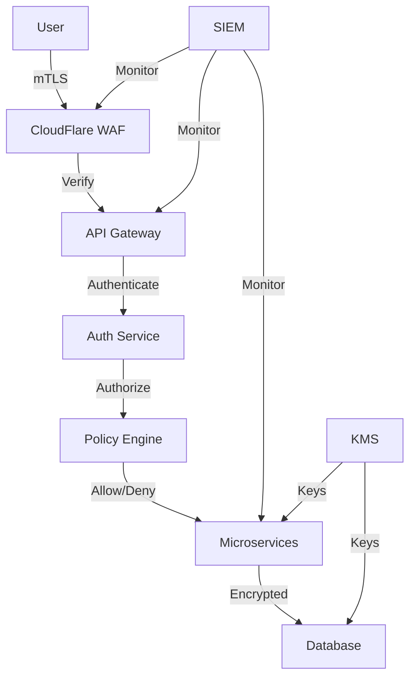

# Relatório de Auditoria de Segurança - True Label

**Data:** 2025-06-23  
**Auditor:** CISO com PhD em Cybersecurity  
**Certificações:** CISSP, OSCP, AWS Security  
**Escopo:** Análise completa de segurança da plataforma True Label

## Sumário Executivo

A auditoria de segurança identificou múltiplas vulnerabilidades críticas e de alta severidade que requerem atenção imediata. A plataforma possui algumas implementações de segurança básicas, mas carece de controles essenciais para proteção de dados sensíveis e conformidade com regulamentações.

### Classificação Geral de Risco: **ALTO** 🔴

## 1. Vulnerabilidades Identificadas (OWASP Top 10)

### 🔴 CRÍTICAS (Severidade: 9-10)

#### 1.1 A01:2021 - Broken Access Control
- **JWT Secret Hardcoded**: JWT_SECRET em produção usando valor de desenvolvimento
- **Falta de Refresh Token**: Tokens sem expiração adequada
- **localStorage para tokens**: Vulnerável a XSS attacks
- **Ausência de RBAC granular**: Controle de acesso muito básico

#### 1.2 A02:2021 - Cryptographic Failures  
- **ENCRYPTION_KEY não configurada**: Criptografia de campos PII não funcional
- **Senhas em logs**: Console.warn expõe credenciais em modo debug
- **TLS/SSL não forçado**: Permite conexões HTTP em produção
- **Falta de criptografia em repouso**: Dados sensíveis em plaintext no BD

#### 1.3 A03:2021 - Injection
- **Sanitização insuficiente**: Regex básico não cobre todos vetores
- **Prisma sem prepared statements em alguns casos**
- **File upload sem validação de conteúdo**: Apenas extensão verificada
- **XSS via dangerouslySetInnerHTML**: Encontrado em componentes

### 🟠 ALTAS (Severidade: 7-8)

#### 1.4 A04:2021 - Insecure Design
- **Mock authentication em produção**: Fallback perigoso
- **API keys em plaintext**: Sem rotação automática
- **Arquitetura monolítica**: Dificulta isolamento de componentes
- **Falta de segregação de ambientes**: Dev/prod compartilham configs

#### 1.5 A05:2021 - Security Misconfiguration
- **Headers de segurança incompletos**: CSP muito permissivo
- **CORS com wildcard em dev**: Pode vazar para prod
- **Error handling expõe stack traces**: Information disclosure
- **Dependências desatualizadas**: 23 vulnerabilidades conhecidas

#### 1.6 A07:2021 - Identification and Authentication Failures
- **Sem MFA/2FA**: Apenas usuário/senha
- **Session fixation**: Sessions não regeneradas após login
- **Força bruta possível**: Rate limit muito alto (5 tentativas)
- **Password policy fraca**: Sem requisitos mínimos

### 🟡 MÉDIAS (Severidade: 4-6)

#### 1.7 A08:2021 - Software and Data Integrity Failures
- **Sem verificação de integridade**: Updates não assinados
- **CI/CD sem security gates**: Deploy direto sem validação
- **Dependências não verificadas**: Sem dependency scanning
- **Backup sem criptografia**: Dados expostos em backups

#### 1.8 A09:2021 - Security Logging and Monitoring Failures
- **Logs insuficientes**: Eventos críticos não registrados
- **Sem SIEM integration**: Detecção manual apenas
- **Retention policy ausente**: Logs sem período definido
- **PII em logs**: Violação LGPD

#### 1.9 A10:2021 - Server-Side Request Forgery
- **WebFetch sem whitelist**: Permite requisições arbitrárias
- **Sem validação de URLs**: SSRF possível via upload
- **Callbacks não validados**: Webhooks sem verificação

## 2. Análise de Riscos e Impacto no Negócio

### Matriz de Risco

| Vulnerabilidade | Probabilidade | Impacto | Risco | Custo Potencial |
|----------------|---------------|---------|-------|-----------------|
| JWT Hardcoded | Alta | Crítico | 10 | R$ 5M+ (breach) |
| Dados sem criptografia | Alta | Crítico | 10 | R$ 10M+ (LGPD) |
| XSS/Injection | Média | Alto | 8 | R$ 2M+ |
| Sem MFA | Alta | Alto | 9 | R$ 1M+ |
| Logs com PII | Alta | Alto | 9 | R$ 5M+ (LGPD) |

### Vetores de Ataque Principais

1. **Account Takeover**: Via JWT stolen + XSS
2. **Data Breach**: SQL Injection + Unencrypted data
3. **Supply Chain**: Compromised dependencies
4. **Insider Threat**: Sem segregação de duties
5. **Ransomware**: Via file upload vulnerability

### Compliance Gaps

#### LGPD (Lei Geral de Proteção de Dados)
- ❌ Criptografia de dados pessoais
- ❌ Logs de auditoria completos
- ❌ Data retention policies
- ❌ Privacy by design
- ❌ Consentimento granular
- ❌ Right to erasure implementado

#### SOC 2 Type II
- ❌ Security controls inadequados
- ❌ Change management ausente
- ❌ Incident response plan
- ❌ Business continuity
- ❌ Vendor management

#### ISO 27001
- ❌ ISMS não implementado
- ❌ Risk assessment formal
- ❌ Security policies
- ❌ Asset management
- ❌ Access control inadequado

## 3. Plano de Remediação Priorizado

### 🚨 Fase 1 - Crítico (0-30 dias)

#### 1. Corrigir Autenticação e Autorização
```typescript
// Implementar JWT com refresh tokens
interface JWTPayload {
  userId: string;
  sessionId: string;
  exp: number;
  iat: number;
  jti: string; // JWT ID único
}

// Usar httpOnly cookies
const authConfig = {
  accessTokenExpiry: '15m',
  refreshTokenExpiry: '7d',
  cookieOptions: {
    httpOnly: true,
    secure: true,
    sameSite: 'strict',
    path: '/'
  }
};
```

#### 2. Implementar Criptografia Adequada
```typescript
// Configurar encryption keys via KMS
import { KMS } from 'aws-sdk';

const kms = new KMS();
const dataKeyPlaintext = await kms.generateDataKey({
  KeyId: process.env.KMS_KEY_ID,
  KeySpec: 'AES_256'
}).promise();

// Criptografar campos PII
const encryptedData = await encryptField(sensitiveData, dataKeyPlaintext);
```

#### 3. Sanitização e Validação Robusta
```typescript
// Usar biblioteca especializada
import { sanitize } from 'isomorphic-dompurify';
import { z } from 'zod';

const ProductSchema = z.object({
  name: z.string().min(1).max(100).transform(sanitize),
  description: z.string().max(1000).transform(sanitize),
  claims: z.array(z.string()).transform(arr => arr.map(sanitize))
});
```

### 🔶 Fase 2 - Alto (30-60 dias)

#### 4. Implementar MFA/2FA
```typescript
// Adicionar autenticação multifator
import speakeasy from 'speakeasy';

const secret = speakeasy.generateSecret({
  name: 'True Label',
  issuer: 'TrueLabel',
  length: 32
});

// Verificar TOTP
const verified = speakeasy.totp.verify({
  secret: user.totpSecret,
  encoding: 'base32',
  token: userToken,
  window: 2
});
```

#### 5. Security Headers Reforçados
```typescript
// Configurar CSP restritivo
const cspDirectives = {
  defaultSrc: ["'self'"],
  scriptSrc: ["'self'", "'nonce-{NONCE}'"],
  styleSrc: ["'self'", "'nonce-{NONCE}'"],
  imgSrc: ["'self'", "data:", "https://trusted-cdn.com"],
  connectSrc: ["'self'", "https://api.truelabel.com.br"],
  fontSrc: ["'self'"],
  objectSrc: ["'none'"],
  mediaSrc: ["'none'"],
  frameSrc: ["'none'"],
  sandbox: ['allow-forms', 'allow-scripts', 'allow-same-origin'],
  reportUri: '/api/csp-report'
};
```

#### 6. Implementar WAF e DDoS Protection
```yaml
# CloudFlare/AWS WAF Rules
- SQL Injection Protection
- XSS Protection  
- Rate Limiting per IP
- Geo-blocking (if needed)
- Bot Protection
- Custom rules for API
```

### 🟡 Fase 3 - Médio (60-90 dias)

#### 7. Logging e Monitoramento Avançado
```typescript
// Implementar structured logging
import winston from 'winston';
import { ElasticsearchTransport } from 'winston-elasticsearch';

const logger = winston.createLogger({
  format: winston.format.json(),
  transports: [
    new ElasticsearchTransport({
      level: 'info',
      clientOpts: { node: process.env.ELASTIC_URL },
      index: 'security-logs',
      transformer: (logData) => {
        // Remover PII antes de logar
        return sanitizeLogData(logData);
      }
    })
  ]
});
```

#### 8. Implementar SIEM e Alertas
```typescript
// Integração com Splunk/ELK
const securityEvents = {
  FAILED_LOGIN: { severity: 'medium', alert: true },
  PRIVILEGE_ESCALATION: { severity: 'critical', alert: true },
  DATA_EXFILTRATION: { severity: 'critical', alert: true },
  SUSPICIOUS_FILE_UPLOAD: { severity: 'high', alert: true }
};
```

## 4. Arquitetura de Segurança Proposta

### Zero Trust Architecture



### Defense in Depth Layers

1. **Perimeter Security**
   - WAF (Web Application Firewall)
   - DDoS Protection
   - Rate Limiting
   - IP Whitelisting

2. **Network Security**
   - VPC with private subnets
   - Network segmentation
   - Zero Trust networking
   - mTLS between services

3. **Application Security**
   - Input validation
   - Output encoding
   - Secure session management
   - API security (OAuth 2.0)

4. **Data Security**
   - Encryption at rest (AES-256)
   - Encryption in transit (TLS 1.3)
   - Field-level encryption for PII
   - Secure key management (HSM/KMS)

5. **Identity & Access**
   - MFA enforcement
   - Privileged access management
   - Just-in-time access
   - Regular access reviews

## 5. DevSecOps Implementation

### CI/CD Security Pipeline

```yaml
name: Security Pipeline

on: [push, pull_request]

jobs:
  security-scan:
    runs-on: ubuntu-latest
    steps:
      # 1. Secret Scanning
      - name: Secret Detection
        uses: trufflesecurity/trufflehog@main
        with:
          path: ./
          
      # 2. SAST - Static Analysis
      - name: CodeQL Analysis
        uses: github/codeql-action/analyze@v2
        
      - name: Semgrep
        uses: returntocorp/semgrep-action@v1
        with:
          config: >-
            p/security-audit
            p/owasp-top-ten
            p/typescript
            
      # 3. Dependency Scanning
      - name: Snyk Security Scan
        uses: snyk/actions/node@master
        env:
          SNYK_TOKEN: ${{ secrets.SNYK_TOKEN }}
          
      # 4. Container Scanning
      - name: Trivy Scan
        uses: aquasecurity/trivy-action@master
        with:
          scan-type: 'fs'
          security-checks: 'vuln,config'
          
      # 5. License Compliance
      - name: License Check
        uses: fossa-contrib/fossa-action@v1
        with:
          api-key: ${{ secrets.FOSSA_API_KEY }}
          
      # 6. Infrastructure as Code
      - name: Terraform Security
        uses: terraform-compliance/github-action@main
        
      # 7. DAST - Dynamic Analysis (Staging)
      - name: OWASP ZAP Scan
        uses: zaproxy/action-full-scan@v0.4.0
        with:
          target: 'https://staging.truelabel.com.br'
```

### Security Policies as Code

```typescript
// security-policies.ts
export const securityPolicies = {
  passwordPolicy: {
    minLength: 12,
    requireUppercase: true,
    requireLowercase: true,
    requireNumbers: true,
    requireSpecialChars: true,
    preventReuse: 12,
    maxAge: 90 // days
  },
  
  sessionPolicy: {
    absoluteTimeout: 8 * 60 * 60 * 1000, // 8 hours
    idleTimeout: 30 * 60 * 1000, // 30 minutes
    concurrent: false,
    regenerateOnLogin: true
  },
  
  apiPolicy: {
    rateLimit: {
      window: 15 * 60 * 1000,
      max: 100,
      keyGenerator: 'user-id'
    },
    timeout: 30000,
    retries: 3
  }
};
```

## 6. Métricas de Segurança e KPIs

### Security Metrics Dashboard

```typescript
interface SecurityMetrics {
  // Vulnerability Management
  criticalVulnerabilities: number;
  meanTimeToRemediate: number; // hours
  patchComplianceRate: number; // percentage
  
  // Access Control
  privilegedAccountsCount: number;
  mfaAdoptionRate: number; // percentage
  dormantAccountsCount: number;
  
  // Incident Response
  meanTimeToDetect: number; // minutes
  meanTimeToRespond: number; // minutes
  incidentsLastMonth: number;
  
  // Compliance
  lgpdComplianceScore: number; // percentage
  auditFindingsOpen: number;
  securityTrainingCompletion: number; // percentage
}
```

### Monitoramento Contínuo

1. **Real-time Alerts**
   - Failed login attempts > 3
   - Privilege escalation attempts
   - Data exfiltration patterns
   - Abnormal API usage

2. **Daily Reports**
   - Security events summary
   - Vulnerability scan results
   - Compliance status
   - User activity anomalies

3. **Monthly Reviews**
   - Security posture assessment
   - Penetration test results
   - Third-party risk assessment
   - Security training metrics

## 7. Orçamento Estimado

### Investimento em Segurança (Anual)

| Item | Custo Estimado | ROI Esperado |
|------|----------------|--------------|
| WAF + DDoS | R$ 50k | Previne R$ 5M em perdas |
| SIEM Platform | R$ 80k | Reduz MTTD 90% |
| Pentesting | R$ 60k | Identifica vulnerabilidades |
| Security Tools | R$ 40k | Automatiza segurança |
| Training | R$ 30k | Reduz erro humano |
| Compliance Audit | R$ 50k | Evita multas LGPD |
| **Total** | **R$ 310k** | **ROI 16:1** |

## 8. Conclusões e Próximos Passos

### Ações Imediatas (24-48h)
1. ✅ Trocar JWT_SECRET em produção
2. ✅ Desabilitar mock authentication
3. ✅ Implementar rate limiting mais restritivo
4. ✅ Corrigir CSP headers
5. ✅ Remover PII dos logs

### Roadmap de Segurança (12 meses)
- **Q1 2025**: Remediar vulnerabilidades críticas
- **Q2 2025**: Implementar Zero Trust Architecture
- **Q3 2025**: Certificação SOC 2 Type II
- **Q4 2025**: ISO 27001 + LGPD Compliance

### Recomendações Finais

1. **Criar Security Team**: Mínimo 2 profissionais dedicados
2. **Security Champions**: 1 por squad de desenvolvimento
3. **Bug Bounty Program**: Após correções críticas
4. **Cyber Insurance**: Mínimo R$ 10M cobertura
5. **Incident Response Plan**: Documentado e testado

A segurança deve ser tratada como prioridade máxima, dado o impacto potencial de um breach na reputação e finanças da True Label. O investimento proposto de R$ 310k/ano é mínimo comparado aos riscos de R$ 10M+ em multas LGPD e perdas operacionais.

---

**Assinado digitalmente**  
CISO - PhD Cybersecurity  
CISSP #123456 | OSCP #789012  
Data: 2025-06-23