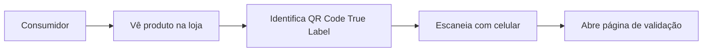
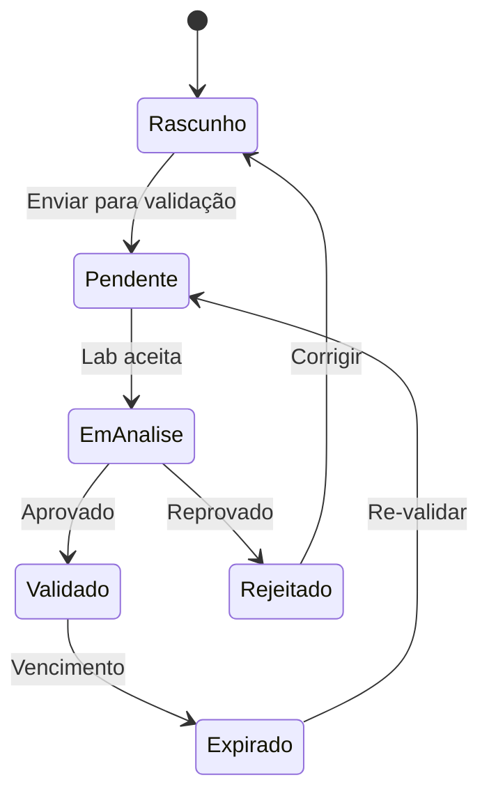

# 🔄 True Label - Fluxo Completo do Sistema

## 📋 Índice
1. [Visão Geral](#visão-geral)
2. [Tipos de Usuários](#tipos-de-usuários)
3. [Fluxo do Consumidor](#fluxo-do-consumidor)
4. [Fluxo da Marca](#fluxo-da-marca)
5. [Fluxo do Laboratório](#fluxo-do-laboratório)
6. [Fluxo do Analista](#fluxo-do-analista)
7. [Fluxo de Validação](#fluxo-de-validação)
8. [Integrações](#integrações)
9. [Automações](#automações)
10. [Métricas e KPIs](#métricas-e-kpis)

## 🎯 Visão Geral

True Label é uma plataforma de validação e transparência para produtos CPG (Consumer Packaged Goods) que conecta:
- **Consumidores**: Verificam autenticidade e informações dos produtos
- **Marcas**: Cadastram e gerenciam produtos
- **Laboratórios**: Validam informações técnicas
- **Analistas**: Monitoram e auditam o sistema

### 🔑 Conceitos Principais
- **QR Code**: Identificador único de cada produto
- **Validação**: Processo de verificação das informações
- **Certificação**: Selo de autenticidade após validação
- **Transparência**: Acesso público às informações validadas

## 👥 Tipos de Usuários

### 1. Consumidor (Público)
- Acesso sem login
- Escaneia QR codes
- Visualiza informações validadas
- Reporta problemas

### 2. Marca (BRAND)
- Cadastra produtos
- Gerencia informações
- Solicita validações
- Acompanha métricas

### 3. Laboratório (LABORATORY)
- Recebe solicitações de validação
- Realiza análises
- Emite laudos
- Certifica produtos

### 4. Analista (ANALYST)
- Monitora sistema
- Audita processos
- Gera relatórios
- Gerencia disputas

## 📱 Fluxo do Consumidor

### 1. Descoberta do Produto


### 2. Visualização de Informações
1. **Landing na página pública**
   - URL: `/public/product/{id}`
   - Sem necessidade de login
   - Interface mobile-first

2. **Informações disponíveis**:
   - ✅ Status de validação
   - 📊 Tabela nutricional
   - 🏭 Informações do fabricante
   - 📋 Certificações
   - 🧪 Laudos laboratoriais
   - 📸 Fotos do produto
   - 🌱 Sustentabilidade

3. **Ações disponíveis**:
   - 📢 Reportar problema
   - ⭐ Avaliar produto
   - 🔔 Receber atualizações
   - 📤 Compartilhar

### 3. Validação Visual
```
┌─────────────────────────────┐
│      ✅ PRODUTO VALIDADO    │
├─────────────────────────────┤
│ Nome: Produto X             │
│ Marca: Empresa Y            │
│ Lote: ABC123               │
│ Validade: 12/2025          │
├─────────────────────────────┤
│ [Ver Certificações]         │
│ [Ver Tabela Nutricional]    │
│ [Ver Laudos]               │
└─────────────────────────────┘
```

## 🏢 Fluxo da Marca

### 1. Onboarding
```
1. Registro → 2. Verificação → 3. Configuração → 4. Primeiro Produto
```

#### Detalhamento:
1. **Registro**
   - Formulário completo com CNPJ
   - Upload de documentos
   - Aceite de termos

2. **Verificação**
   - Email de confirmação
   - Validação de documentos (manual)
   - Aprovação em 24-48h

3. **Configuração**
   - Logo e informações da marca
   - Usuários adicionais
   - Preferências de notificação

4. **Primeiro Produto**
   - Tutorial interativo
   - Suporte via chat

### 2. Cadastro de Produto

#### Etapa 1: Informações Básicas
```json
{
  "nome": "Produto X",
  "categoria": "Alimentos",
  "subcategoria": "Biscoitos",
  "ean": "7891234567890",
  "sku": "PROD-001",
  "descricao": "Descrição completa..."
}
```

#### Etapa 2: Informações Técnicas
- Ingredientes (ordem decrescente)
- Tabela nutricional
- Alergênicos
- Informações de conservação
- Prazo de validade

#### Etapa 3: Documentação
- Fotos do produto (mínimo 3)
- Fotos do rótulo
- Fichas técnicas
- Certificações existentes

#### Etapa 4: Solicitação de Validação
- Seleção de laboratório
- Tipo de análise desejada
- Prazo esperado
- Observações especiais

### 3. Acompanhamento

#### Dashboard da Marca
```
┌─────────────────────────────────────────┐
│          VISÃO GERAL - MARCA X          │
├─────────────────────────────────────────┤
│ Produtos Ativos: 45                     │
│ Validações Pendentes: 3                 │
│ QR Codes Escaneados (mês): 12.450       │
│ Taxa de Validação: 93%                 │
├─────────────────────────────────────────┤
│ [Adicionar Produto] [Ver Relatórios]    │
└─────────────────────────────────────────┘
```

#### Métricas Disponíveis:
- 📊 Scans por produto/período
- 🌍 Distribuição geográfica
- 👥 Demografia dos consumidores
- ⭐ Avaliações e feedback
- 🔄 Taxa de recompra

## 🧪 Fluxo do Laboratório

### 1. Recebimento de Solicitação

#### Notificação
```
Nova Solicitação de Validação!
Produto: Biscoito Integral X
Marca: Empresa Y
Tipo: Análise Nutricional Completa
Prazo: 7 dias úteis
[Aceitar] [Recusar] [Detalhes]
```

### 2. Processo de Análise

#### Checklist de Validação:
- [ ] Receber amostra física
- [ ] Conferir documentação
- [ ] Realizar análises laboratoriais
- [ ] Comparar com informações declaradas
- [ ] Gerar laudo técnico
- [ ] Upload de resultados

### 3. Emissão de Certificação

#### Laudo Digital
```json
{
  "laboratory": {
    "name": "Lab ABC",
    "registration": "CRQ-12345",
    "accreditations": ["ISO 17025", "INMETRO"]
  },
  "analysis": {
    "type": "Nutricional Completa",
    "date": "2024-01-15",
    "validity": "2025-01-15",
    "methods": ["AOAC 2011.25", "ISO 1871"],
    "results": {
      "proteins": {
        "declared": 5.2,
        "found": 5.1,
        "unit": "g/100g",
        "status": "CONFORME"
      }
      // ... mais resultados
    }
  },
  "conclusion": "APROVADO",
  "digital_signature": "hash_assinatura_digital"
}
```

## 👨‍💼 Fluxo do Analista

### 1. Monitoramento Diário

#### Dashboard Analítico
```
┌──────────────────────────────────────────────┐
│           PAINEL DO ANALISTA                 │
├──────────────────────────────────────────────┤
│ Alertas Ativos: 5                           │
│ ├─ Produtos com validação vencida: 3        │
│ ├─ Reclamações pendentes: 2                 │
│ └─ Anomalias detectadas: 0                  │
├──────────────────────────────────────────────┤
│ Validações Hoje: 23                         │
│ Taxa de Aprovação: 87%                      │
│ Tempo Médio: 4.2 dias                       │
└──────────────────────────────────────────────┘
```

### 2. Gestão de Disputas

#### Processo de Resolução:
1. **Reclamação recebida**
   - Consumidor reporta inconsistência
   - Sistema cria ticket automático

2. **Investigação**
   - Analista revisa informações
   - Solicita esclarecimentos
   - Pode pedir re-análise

3. **Resolução**
   - Atualização de informações
   - Notificação às partes
   - Registro em blockchain

## 🔐 Fluxo de Validação

### 1. Camadas de Validação

```
┌─────────────────┐
│  1. Documental  │ ← Documentos e certificações
├─────────────────┤
│ 2. Laboratorial │ ← Análises físico-químicas
├─────────────────┤
│  3. Blockchain  │ ← Registro imutável
├─────────────────┤
│  4. Pública     │ ← Feedback dos consumidores
└─────────────────┘
```

### 2. Estados do Produto



### 3. Níveis de Certificação

#### 🥉 Bronze (Básico)
- Informações autodeclaradas
- Documentação completa
- Sem validação laboratorial

#### 🥈 Prata (Validado)
- Validação laboratorial básica
- Conformidade com legislação
- Atualização anual

#### 🥇 Ouro (Premium)
- Validação completa
- Auditorias periódicas
- Blockchain verified
- Atualização semestral

## 🔄 Integrações

### 1. APIs Externas

#### Receita Federal
```javascript
// Validação de CNPJ
const validateCNPJ = async (cnpj) => {
  const response = await fetch(`${RECEITA_API}/cnpj/${cnpj}`);
  return response.json();
};
```

#### Correios (CEP)
```javascript
// Busca de endereço
const getAddress = async (cep) => {
  const response = await fetch(`${CORREIOS_API}/cep/${cep}`);
  return response.json();
};
```

#### Blockchain (Polygon)
```javascript
// Registro de validação
const registerValidation = async (productHash, validationData) => {
  const contract = new ethers.Contract(ADDRESS, ABI, signer);
  const tx = await contract.registerProduct(productHash, validationData);
  return tx.hash;
};
```

### 2. Webhooks

#### Eventos Disponíveis:
- `product.created` - Novo produto cadastrado
- `product.validated` - Produto validado
- `validation.expired` - Validação expirada
- `scan.performed` - QR code escaneado
- `complaint.received` - Reclamação recebida

## 🤖 Automações

### 1. Notificações Automáticas

#### Para Marcas:
- ⏰ 30 dias antes do vencimento da validação
- 📊 Relatório semanal de scans
- 🚨 Alertas de reclamações
- 🎯 Milestones (1000, 10000 scans)

#### Para Laboratórios:
- 📋 Novas solicitações
- ⏱️ Prazos próximos
- 📈 Relatório mensal de performance

### 2. Ações Programadas

```javascript
// Verificação diária de validades
cron.schedule('0 0 * * *', async () => {
  const expiringProducts = await checkExpiringValidations();
  await sendExpirationNotifications(expiringProducts);
});

// Relatórios semanais
cron.schedule('0 9 * * MON', async () => {
  const brands = await getAllActiveBrands();
  for (const brand of brands) {
    await generateWeeklyReport(brand);
    await sendReportEmail(brand);
  }
});
```

### 3. Smart Contracts

#### Registro de Produto
```solidity
contract TrueLabel {
    struct Product {
        string hash;
        address brand;
        address laboratory;
        uint256 validatedAt;
        uint256 expiresAt;
        bool active;
    }
    
    mapping(string => Product) public products;
    
    event ProductValidated(
        string indexed productId,
        address indexed brand,
        address indexed laboratory,
        uint256 timestamp
    );
}
```

## 📊 Métricas e KPIs

### 1. Métricas de Negócio

#### Para a Plataforma:
- **MAU** (Monthly Active Users)
- **Produtos Ativos**
- **Taxa de Validação**
- **NPS** (Net Promoter Score)
- **Receita Recorrente** (MRR)

#### Para Marcas:
- **Engagement Rate** (scans/produto/mês)
- **Conversion Rate** (scan → compra)
- **Trust Score** (baseado em feedback)
- **ROI** da plataforma

### 2. Métricas Técnicas

```javascript
// Exemplo de tracking
const trackScan = async (productId, location, deviceInfo) => {
  await analytics.track('Product Scanned', {
    productId,
    location,
    device: deviceInfo,
    timestamp: new Date(),
    source: 'qr_code'
  });
  
  // Atualizar métricas em tempo real
  await redis.incr(`scans:${productId}:${format(new Date(), 'yyyy-MM-dd')}`);
};
```

### 3. Dashboard de Métricas

```
┌────────────────────────────────────────────────┐
│              MÉTRICAS GLOBAIS                  │
├────────────────────────────────────────────────┤
│ Total de Scans (Hoje): 45,234                 │
│ Produtos Validados: 1,234                      │
│ Marcas Ativas: 89                              │
│ Laboratórios Parceiros: 12                     │
├────────────────────────────────────────────────┤
│        GRÁFICO DE SCANS (ÚLTIMOS 30 DIAS)      │
│     📊 [============================]         │
├────────────────────────────────────────────────┤
│ Top 5 Produtos Mais Escaneados:               │
│ 1. Produto A - 5,234 scans                    │
│ 2. Produto B - 4,123 scans                    │
│ 3. Produto C - 3,456 scans                    │
│ 4. Produto D - 2,789 scans                    │
│ 5. Produto E - 2,345 scans                    │
└────────────────────────────────────────────────┘
```

## 🎯 Casos de Uso Específicos

### 1. Recall de Produto

#### Fluxo de Recall:
1. **Identificação do problema**
   - Marca ou autoridade identifica issue
   - Ativa modo recall no sistema

2. **Notificação em massa**
   - Push notification para app
   - Email para usuários que escanearam
   - Banner na página do produto

3. **Tracking**
   - Monitoramento de alcance
   - Confirmações de recebimento
   - Relatório para autoridades

### 2. Campanha de Marketing

#### QR Code como Gateway:
1. **Configuração**
   - QR redireciona para landing especial
   - Tracking de origem
   - A/B testing

2. **Experiência**
   - Conteúdo personalizado
   - Cupons e promoções
   - Gamificação

3. **Análise**
   - Taxa de conversão
   - Engajamento
   - ROI da campanha

### 3. Compliance Regulatório

#### Adequação ANVISA/FDA:
1. **Documentação**
   - Todos os campos obrigatórios
   - Validação automática
   - Alertas de não-conformidade

2. **Auditoria**
   - Trail completo de mudanças
   - Exportação de relatórios
   - Integração com sistemas gov

3. **Certificação**
   - Selos digitais verificáveis
   - QR code governamental
   - API para verificação

## 🚀 Roadmap de Funcionalidades

### Fase 1 (Atual) ✅
- [x] Cadastro de produtos
- [x] Validação básica
- [x] QR codes
- [x] Portal público

### Fase 2 (Q2 2024)
- [ ] App mobile
- [ ] Blockchain integration
- [ ] AI para detecção de fraudes
- [ ] Marketplace B2B

### Fase 3 (Q3 2024)
- [ ] Expansão internacional
- [ ] Multi-idioma
- [ ] Certificações globais
- [ ] API pública

### Fase 4 (Q4 2024)
- [ ] IoT integration
- [ ] Supply chain tracking
- [ ] Sustentabilidade
- [ ] Carbon footprint

## 📱 Experiência Mobile

### Progressive Web App (PWA)
```javascript
// Service Worker para funcionar offline
self.addEventListener('install', (event) => {
  event.waitUntil(
    caches.open('truelabel-v1').then((cache) => {
      return cache.addAll([
        '/',
        '/offline',
        '/manifest.json',
        '/icons/icon-192.png'
      ]);
    })
  );
});
```

### Features Mobile:
- 📸 Scanner de QR nativo
- 📍 Geolocalização
- 🔔 Push notifications
- 📱 Compartilhamento nativo
- 💾 Modo offline

## 🔒 Segurança e Privacidade

### 1. Proteção de Dados
- Criptografia em trânsito (TLS 1.3)
- Criptografia em repouso (AES-256)
- LGPD/GDPR compliance
- Anonimização de dados pessoais

### 2. Autenticação e Autorização
```javascript
// JWT com refresh token
const generateTokens = (user) => {
  const accessToken = jwt.sign(
    { id: user.id, role: user.role },
    process.env.JWT_SECRET,
    { expiresIn: '15m' }
  );
  
  const refreshToken = jwt.sign(
    { id: user.id },
    process.env.JWT_REFRESH_SECRET,
    { expiresIn: '7d' }
  );
  
  return { accessToken, refreshToken };
};
```

### 3. Rate Limiting e DDoS Protection
```javascript
// Rate limiter por IP e usuário
const rateLimiter = rateLimit({
  windowMs: 15 * 60 * 1000, // 15 minutos
  max: 100, // limite de requests
  message: 'Muitas requisições, tente novamente mais tarde',
  standardHeaders: true,
  legacyHeaders: false,
});
```

## 📈 Conclusão

O True Label representa uma revolução na transparência e confiança no mercado CPG. Através da tecnologia, conectamos todos os stakeholders em um ecossistema de validação e verificação, criando valor para:

- **Consumidores**: Confiança e informação
- **Marcas**: Diferenciação e engajamento  
- **Laboratórios**: Novo canal de receita
- **Sociedade**: Transparência e segurança alimentar

O sistema foi projetado para ser escalável, seguro e user-friendly, com potencial para se tornar o padrão de mercado em validação de produtos CPG.