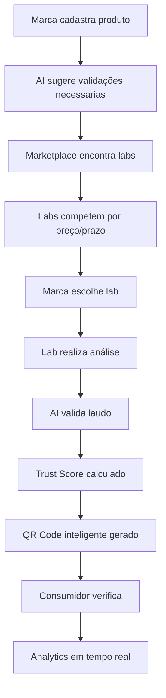

# TRUST Label - Visão Estratégica de Produto (CPO Vision)

## 🎯 Missão
Tornar o TRUST Label o padrão global de validação e transparência para produtos de consumo, criando um ecossistema onde a confiança é verificável, mensurável e valorizada.

## 🚀 Visão de Produto - Como Nos Tornamos Referência

### 1. **O Problema Central**
- **Consumidores**: Não confiam em claims de produtos (80% acham que marcas exageram)
- **Marcas**: Investem em qualidade mas não conseguem provar diferenciação
- **Laboratórios**: Têm capacidade ociosa e processos manuais
- **Prescritores**: Precisam de dados confiáveis para recomendar

### 2. **Nossa Solução Diferenciada**

#### A. **Trust Score™ - O Novo Padrão**
```
Trust Score = (Validações Confirmadas × Peso) + (Freshness × 0.3) + (Completude × 0.2)
```
- Score de 0-100 que se torna o "credit score" de produtos
- Algoritmo proprietário que considera:
  - Quantidade de validações
  - Qualidade dos laboratórios
  - Frequência de revalidação
  - Histórico de conformidade

#### B. **Marketplace de Validação**
- Conecta marcas com laboratórios em tempo real
- Leilão reverso para melhor preço
- Smart contracts para garantir execução
- Rating system bilateral

#### C. **AI Validation Engine**
- Analisa laudos automaticamente
- Detecta inconsistências
- Sugere validações complementares
- Prediz problemas regulatórios

### 3. **Fluxo de Trabalho Revolucionário**



### 4. **Modelo de Negócio Escalável**

#### Fontes de Receita:
1. **Subscription (SaaS)**
   - Starter: R$ 999/mês (5 SKUs)
   - Growth: R$ 2.999/mês (20 SKUs)
   - Enterprise: R$ 9.999/mês (ilimitado)

2. **Transaction Fees**
   - 10% sobre cada validação no marketplace
   - R$ 50 por QR Code inteligente

3. **Data & Insights**
   - Reports de mercado: R$ 5.000
   - API access: R$ 0,10 por chamada
   - Benchmark reports: R$ 10.000

4. **Premium Features**
   - AI Insights: R$ 500/mês
   - Blockchain certificate: R$ 100/certificado
   - White label: R$ 50.000 setup + R$ 5.000/mês

### 5. **Network Effects & Moat**

#### Network Effects:
- **Dois lados**: Mais marcas → Mais labs → Menor custo → Mais marcas
- **Dados**: Mais validações → Melhor AI → Melhores insights → Mais valor
- **Confiança**: Mais consumidores → Mais scans → Mais valor para marcas

#### Moat Competitivo:
1. **Dados proprietários**: Banco de validações único
2. **Trust Score™**: Algoritmo patenteado
3. **Rede de labs**: Contratos exclusivos
4. **Blockchain**: Imutabilidade e rastreabilidade
5. **Regulatório**: Primeiro a estabelecer padrão

### 6. **Go-to-Market Strategy**

#### Fase 1: Land (0-6 meses)
- Foco: Suplementos e funcionais
- Meta: 100 marcas premium
- Estratégia: White glove service

#### Fase 2: Expand (6-18 meses)
- Foco: Alimentos saudáveis
- Meta: 1.000 marcas
- Estratégia: Self-service + marketplace

#### Fase 3: Dominate (18-36 meses)
- Foco: Todo CPG
- Meta: 10.000 marcas
- Estratégia: API-first + parcerias

### 7. **Métricas de Sucesso**

#### North Star Metric:
**Produtos Validados Ativos** (meta: 100.000 em 3 anos)

#### Métricas Chave:
- MRR: R$ 10M em 36 meses
- Trust Score médio: >85
- Scans/mês: 10M
- NPS: >70
- Lab utilization: >80%

### 8. **Roadmap Estratégico**

#### Q1 2025: Foundation
- [x] QR tracking system
- [ ] Lab integration API
- [ ] Basic Trust Score
- [ ] Marketplace MVP

#### Q2 2025: Intelligence
- [ ] AI validation engine
- [ ] Predictive analytics
- [ ] Mobile apps
- [ ] Blockchain integration

#### Q3 2025: Scale
- [ ] International expansion
- [ ] White label platform
- [ ] Consumer app
- [ ] B2B marketplace

#### Q4 2025: Ecosystem
- [ ] Developer API
- [ ] Partner integrations
- [ ] Trust Score licensing
- [ ] IPO preparation

### 9. **Vantagem Competitiva Sustentável**

1. **First Mover**: Primeiro a criar padrão unificado
2. **Tech Advantage**: AI + Blockchain + IoT
3. **Network Density**: Efeito de rede impossível de replicar
4. **Brand Trust**: "Intel Inside" dos produtos de consumo
5. **Data Moat**: Maior banco de validações do mundo

### 10. **Visão de 5 Anos**

**2030: TRUST Label é o padrão global**
- Presente em 50 países
- 1M produtos validados
- R$ 1B valuation
- IPO na NASDAQ
- Trust Score em toda embalagem
- Consumidores não compram sem verificar

## 🎯 Próximos Passos Imediatos

1. **Implementar Lab Integration System** (atual)
2. **Desenvolver Trust Score Algorithm**
3. **Criar Marketplace MVP**
4. **Lançar Pilot com 10 marcas**
5. **Raise Série A (R$ 20M)**

---

*"In Trust We Build"* - TRUST Label, redefinindo confiança no consumo.