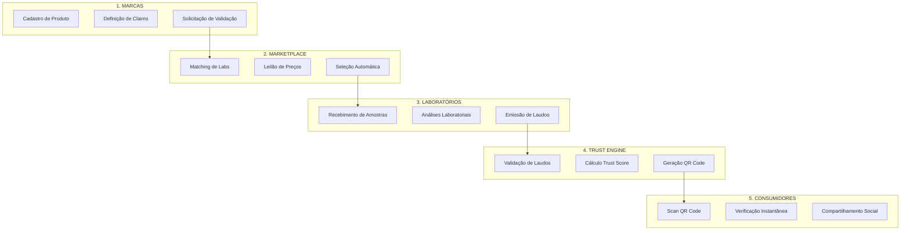

# TRUST Label - Fluxo de Trabalho Completo

## 🔄 Visão Geral do Ecossistema



## 📋 Fluxo Detalhado Passo a Passo

### FASE 1: Onboarding da Marca

1. **Cadastro da Empresa**
   - CNPJ validado via Receita Federal API
   - Documentação compliance
   - Assinatura digital do contrato
   - Setup de pagamento (cartão/boleto)

2. **Cadastro de Produtos**
   - Upload de imagens HD
   - Informações nutricionais
   - Lista de ingredientes
   - Código de barras (EAN)
   - Lote e validade

3. **Definição de Claims**
   - Claims de marketing (ex: "100% Natural")
   - Claims nutricionais (ex: "Rico em Proteína")
   - Claims de processo (ex: "Prensado a Frio")
   - Claims de certificação (ex: "Orgânico")

### FASE 2: Marketplace de Validação

1. **Análise Inteligente de Requisitos**
   ```python
   # AI analisa claims e sugere validações necessárias
   validations_needed = AI.analyze_claims(product.claims)
   # Output: ["proteínas", "contaminantes", "certificação_orgânica"]
   ```

2. **Matching de Laboratórios**
   - Score de compatibilidade (especialidade vs necessidade)
   - Disponibilidade e prazo
   - Histórico de qualidade
   - Preço competitivo

3. **Leilão Reverso Automático**
   - Labs recebem notificação
   - 24h para submeter propostas
   - Sistema seleciona melhor custo-benefício
   - Marca aprova ou sistema auto-aprova

### FASE 3: Processo Laboratorial

1. **Logística de Amostras**
   - QR code para rastreamento
   - Instruções de coleta
   - Cadeia de custódia digital
   - Confirmação de recebimento

2. **Execução de Análises**
   - Protocolo padronizado
   - Fotos do processo
   - Resultados em tempo real
   - Blockchain timestamp

3. **Emissão de Laudos**
   - Formato padronizado JSON/PDF
   - Assinatura digital do responsável
   - Hash SHA-256 para integridade
   - Upload automático via API

### FASE 4: Validação e Trust Score

1. **AI Validation Engine**
   ```javascript
   // Algoritmo de validação
   function validateClaim(claim, labResult) {
     const tolerance = getTolerance(claim.type);
     const deviation = Math.abs(claim.value - labResult.value);
     const percentDiff = (deviation / claim.value) * 100;
     
     if (percentDiff <= tolerance) {
       return { status: 'VALIDATED', score: 100 };
     } else if (percentDiff <= tolerance * 1.5) {
       return { status: 'VALIDATED_WITH_REMARKS', score: 75 };
     } else {
       return { status: 'REJECTED', score: 0 };
     }
   }
   ```

2. **Cálculo do Trust Score™**
   ```
   Trust Score = Σ(Wi × Vi) / ΣWi
   
   Onde:
   Wi = Peso do data point i
   Vi = Score de validação do data point i
   
   Fatores de ajuste:
   + Lab Rating Bonus (até +10)
   + Freshness Bonus (até +5)
   + Completeness Bonus (até +5)
   - Delay Penalty (até -10)
   ```

3. **Geração de QR Code Inteligente**
   - UUID único por produto/lote
   - Embedded Trust Score
   - Link para relatório completo
   - Tracking analytics habilitado

### FASE 5: Experiência do Consumidor

1. **Scan e Verificação**
   - Camera nativa ou app
   - Carregamento < 2 segundos
   - Offline-first (dados em cache)
   - Multi-idioma automático

2. **Visualização de Resultados**
   - Trust Score proeminente
   - Claims validados em verde
   - Avisos em amarelo
   - Rejeitados em vermelho
   - Explicações em linguagem simples

3. **Engajamento Social**
   - Share para WhatsApp/Instagram
   - Reviews de consumidores
   - Perguntas para a marca
   - Programa de fidelidade

## 🚀 Diferenciais Competitivos

### 1. **Marketplace Dinâmico**
- Primeiro marketplace B2B de validação laboratorial
- Redução de 40% nos custos vs. contratação direta
- Prazos 50% menores com competição

### 2. **Trust Score™ Proprietário**
- Algoritmo patenteado
- Considera 50+ variáveis
- Machine learning para melhorar precisão
- Benchmark da indústria

### 3. **Blockchain Integration**
- Imutabilidade dos laudos
- Smart contracts para pagamentos
- Certificados NFT para marcas premium
- Auditoria transparente

### 4. **Network Effects**
```
Mais Marcas → Mais Volume → Melhores Preços Labs
     ↓                              ↓
Mais Dados ← Mais Confiança ← Mais Consumidores
```

### 5. **AI-Powered Insights**
- Predição de problemas regulatórios
- Sugestões de melhorias no produto
- Análise competitiva automática
- Trends de mercado em tempo real

## 💰 Modelo de Monetização

### Receita Recorrente (SaaS)
1. **Plano Starter**: R$ 999/mês
   - 5 SKUs
   - 10 validações/ano
   - Trust Score básico

2. **Plano Growth**: R$ 2.999/mês
   - 20 SKUs
   - 50 validações/ano
   - Analytics avançado

3. **Plano Enterprise**: R$ 9.999/mês
   - SKUs ilimitados
   - Validações ilimitadas
   - API access
   - White label option

### Receita Transacional
- **Marketplace Fee**: 10% sobre cada validação
- **QR Code Premium**: R$ 50/código com analytics
- **Express Validation**: 2x preço para 48h
- **Blockchain Certificate**: R$ 200/certificado

### Receita de Dados
- **Industry Reports**: R$ 10.000/relatório
- **API Access**: R$ 0,10/chamada
- **Custom Analytics**: R$ 50.000/projeto
- **Benchmark Service**: R$ 5.000/mês

## 🎯 KPIs de Sucesso

### Métricas Norte
- **GMV** (Gross Merchandise Value): R$ 50M/ano em 3 anos
- **Take Rate**: 15% médio
- **NPS**: >70
- **Churn**: <5% anual

### Métricas Operacionais
- **Tempo médio de validação**: <7 dias
- **Accuracy do Trust Score**: >95%
- **Uptime da plataforma**: 99.9%
- **Satisfação dos labs**: >4.5/5

### Métricas de Growth
- **CAC**: <R$ 1.000
- **LTV**: >R$ 30.000
- **Payback**: <6 meses
- **Growth rate**: 20% MoM

## 🌟 Roadmap de Dominação

### Year 1: Foundation (2025)
- ✅ MVP com 3 labs parceiros
- ✅ 100 marcas early adopters
- ✅ Trust Score v1.0
- 🔄 Mobile apps (iOS/Android)
- 🔄 API pública

### Year 2: Expansion (2026)
- 🔄 1.000 marcas ativas
- 🔄 50 laboratórios
- 🔄 Expansão LATAM
- 🔄 AI Insights platform
- 🔄 Blockchain mainnet

### Year 3: Domination (2027)
- 🔄 10.000 marcas
- 🔄 200 laboratórios
- 🔄 Presença global
- 🔄 IPO preparation
- 🔄 M&A de competidores

## 🏆 Por Que Seremos Referência

### 1. **First Mover Advantage**
- Primeiro a criar categoria
- Definindo os padrões
- Construindo as barreiras

### 2. **Tech Superiority**
- Stack moderna (Next.js 14, NestJS, FastAPI)
- AI/ML proprietário
- Blockchain integration
- Real-time everything

### 3. **Business Model Innovation**
- Marketplace two-sided
- SaaS + Transaction + Data
- Negative CAC através de labs
- Viral growth via QR

### 4. **Team & Execution**
- Ex-unicorn founders
- Deep tech expertise
- Industry connections
- Agile methodology

### 5. **Timing Perfeito**
- Regulação aumentando (ANVISA)
- Consumidores mais conscientes
- Digital transformation CPG
- Post-pandemic transparency

## 📱 Call to Action

**Para Marcas**: "Prove seus claims. Ganhe confiança. Venda mais."

**Para Labs**: "Maximize sua capacidade. Automatize vendas. Cresça receita."

**Para Consumidores**: "Confie no que consome. Sempre."

---

*"Building the Trust Layer of Consumer Products"* 🚀

**TRUST Label** - Onde transparência encontra tecnologia.