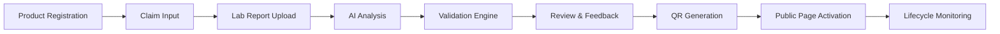
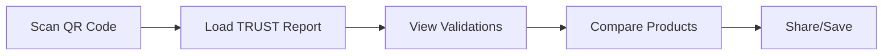

# TRUST LABEL - Mental Map & Architecture

## 🎯 Core Concept
TRUST LABEL is an AI-powered CPG validation platform that connects product claims to accredited laboratory reports through intelligent QR codes, providing transparent and trustworthy product information to consumers, prescribers, and brands.

## 🏗️ System Architecture

### 1. Frontend Applications
```
trust-label-web/
├── Public Portal (Next.js 14)
│   ├── TRUST Verified Report (PWA)
│   ├── TRUST Search
│   ├── TRUST Compare
│   └── TRUST Insights
│
├── Dashboard (Next.js 14)
│   ├── Brand Portal
│   ├── Laboratory Portal
│   ├── Prescriber Portal
│   └── Admin Portal
│
└── Mobile Apps (React Native)
    ├── Consumer App
    └── Prescriber App
```

### 2. Backend Services
```
trust-label-api/
├── Core Services (NestJS)
│   ├── Authentication Service
│   ├── Product Management
│   ├── Validation Engine
│   ├── QR Generator
│   └── Analytics Service
│
├── AI Services (Python/FastAPI)
│   ├── Claim Analyzer
│   ├── Document Parser
│   ├── Anomaly Detector
│   └── Prediction Engine
│
└── Integration Services
    ├── Laboratory APIs
    ├── Regulatory APIs
    └── Blockchain Service
```

### 3. Data Architecture
```
Data Layer/
├── PostgreSQL (Primary)
│   ├── Products
│   ├── Validations
│   ├── Users
│   └── Reports
│
├── Redis (Cache & Queue)
│   ├── Session Store
│   ├── QR Cache
│   └── Job Queue
│
├── MinIO (Object Storage)
│   ├── Lab Reports
│   ├── Product Images
│   └── Certificates
│
└── ElasticSearch
    ├── Product Search
    └── Analytics Data
```

## 🔄 Core Workflows

### 1. Validation Flow


### 2. Consumer Journey


## 💡 Key Improvements Over True Label

### 1. AI-Powered Features
- **Smart Claim Extraction**: Automatically extract claims from product labels using OCR and NLP
- **Intelligent Matching**: AI matches claims with lab report data points
- **Anomaly Detection**: Identifies unusual patterns in validation data
- **Predictive Analytics**: Forecasts validation expiration and formula changes

### 2. Enhanced UX/UI
- **Progressive Disclosure**: Information presented in layers for better comprehension
- **Interactive Visualizations**: Charts and graphs for nutrition data
- **Personalization**: Customized views based on user preferences
- **Accessibility First**: WCAG AAA compliance

### 3. Advanced Features
- **Blockchain Verification**: Optional blockchain anchoring for reports
- **Real-time Collaboration**: Live updates during validation process
- **Smart Notifications**: Proactive alerts for expiring validations
- **API Marketplace**: Third-party integrations

## 📋 Data Points Structure

### Categories with Enhanced Tracking
1. **Nutritional Profile**
   - Calories, Proteins, Carbohydrates, Fats
   - Vitamins (A, B complex, C, D, E, K)
   - Minerals (Iron, Calcium, Zinc, etc.)
   - AI confidence score for each point

2. **Microbiology**
   - Salmonella, E. coli, Mycotoxins
   - Real-time contamination risk assessment

3. **Heavy Metals**
   - Mercury, Arsenic, Cadmium, Lead
   - Trend analysis over time

4. **Allergens**
   - 14 major allergens tracking
   - Cross-contamination risk scoring

5. **Certifications**
   - Organic, B Corp, Non-GMO, Gluten-free
   - Automatic expiration tracking

6. **Banned Substances**
   - WADA prohibited list integration
   - Automatic regulatory updates

## 🎨 Design System

### TRUST Design Principles
1. **Clarity**: Information hierarchy that guides users
2. **Trust**: Visual indicators for validation status
3. **Accessibility**: High contrast, clear typography
4. **Responsiveness**: Mobile-first approach
5. **Delight**: Micro-interactions and animations

### Color System
```scss
// Semantic Colors
$trust-validated: #10B981;      // Green
$trust-pending: #F59E0B;        // Amber
$trust-failed: #EF4444;         // Red
$trust-expired: #6B7280;        // Gray

// Brand Colors
$trust-primary: #0EA5E9;        // Sky Blue
$trust-secondary: #8B5CF6;      // Purple
$trust-accent: #EC4899;         // Pink
```

## 🚀 Implementation Phases

### Phase 1: Foundation (Weeks 1-2)
- Project setup with Nx monorepo
- Core authentication system
- Basic product management
- Simple validation engine

### Phase 2: Intelligence (Weeks 3-4)
- AI claim analyzer
- Smart validation matching
- Automated report parsing
- Confidence scoring

### Phase 3: Public Portal (Weeks 5-6)
- TRUST Verified Report pages
- QR code generation
- Search functionality
- Mobile optimization

### Phase 4: Advanced Features (Weeks 7-8)
- Blockchain integration
- Real-time notifications
- Analytics dashboard
- API marketplace

## 📊 Success Metrics

### Technical KPIs
- Page load time < 2s
- API response time < 100ms
- 99.9% uptime
- Zero security breaches

### Business KPIs
- Validation accuracy > 95%
- User satisfaction > 4.5/5
- Monthly active users growth > 20%
- Customer retention > 80%

### User Experience KPIs
- Task completion rate > 90%
- Error rate < 2%
- Time to first validation < 5 minutes
- Mobile usage > 60%

## 🔐 Security & Compliance

### Security Measures
- End-to-end encryption
- JWT with refresh tokens
- Rate limiting and DDoS protection
- Regular security audits

### Compliance
- LGPD (Brazilian data protection)
- ISO/IEC 17029 certification
- SOC 2 Type II
- NIST framework

## 🌐 Scalability Strategy

### Technical Scalability
- Microservices architecture
- Horizontal scaling with Kubernetes
- CDN for static assets
- Database sharding

### Business Scalability
- Multi-tenant architecture
- White-label options
- API-first approach
- Plugin ecosystem

## 🤝 Integration Ecosystem

### Laboratory Partners
- Eurofins, SGS, SFDK
- Direct API integration
- Automated report ingestion
- Real-time status updates

### Regulatory Bodies
- ANVISA integration
- FDA database access
- EU food safety APIs
- Automatic compliance updates

### E-commerce Platforms
- Shopify plugin
- WooCommerce integration
- Amazon verified badges
- Custom API endpoints