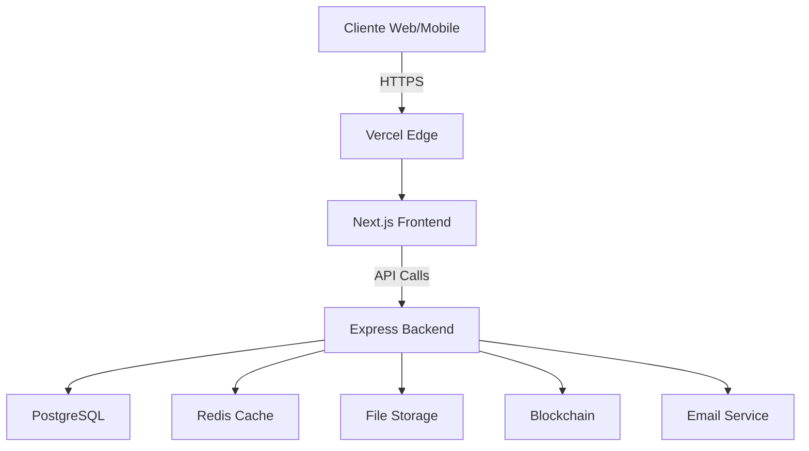

# 🔧 True Label - Fluxo de Implementação Técnica

## 📋 Índice
1. [Arquitetura do Sistema](#arquitetura-do-sistema)
2. [Fluxo de Autenticação](#fluxo-de-autenticação)
3. [Fluxo de Cadastro de Produto](#fluxo-de-cadastro-de-produto)
4. [Fluxo de Validação](#fluxo-de-validação)
5. [Fluxo de QR Code](#fluxo-de-qr-code)
6. [Integrações e APIs](#integrações-e-apis)
7. [Segurança e Performance](#segurança-e-performance)

## 🏗️ Arquitetura do Sistema

### Stack Tecnológico
```
┌─────────────────────────────────────────────────────┐
│                    FRONTEND                         │
├─────────────────────────────────────────────────────┤
│  React 18  │  TypeScript  │  Vite  │  TailwindCSS  │
│  Zustand   │  React Query │  Zod   │  React Hook Form│
└─────────────────────────────────────────────────────┘
                            ↕️
┌─────────────────────────────────────────────────────┐
│                    BACKEND                          │
├─────────────────────────────────────────────────────┤
│  Node.js   │  Express    │  TypeScript │  Prisma    │
│  PostgreSQL│  Redis      │  JWT        │  Multer    │
└─────────────────────────────────────────────────────┘
                            ↕️
┌─────────────────────────────────────────────────────┐
│                   INFRAESTRUTURA                    │
├─────────────────────────────────────────────────────┤
│  Vercel    │  Supabase   │  Upstash   │  SendGrid  │
│  Cloudinary│  Sentry     │  Polygon   │  AWS S3    │
└─────────────────────────────────────────────────────┘
```

### Fluxo de Dados


## 🔐 Fluxo de Autenticação

### 1. Login Flow
```typescript
// Frontend: /src/services/authService.ts
export const login = async (credentials: LoginCredentials) => {
  try {
    // 1. Validação local
    const validated = loginSchema.parse(credentials);
    
    // 2. Request para API
    const response = await api.post('/auth/login', validated);
    
    // 3. Armazenar tokens
    const { accessToken, refreshToken, user } = response.data;
    
    // Secure storage
    localStorage.setItem('accessToken', accessToken);
    localStorage.setItem('refreshToken', refreshToken);
    
    // 4. Atualizar store global
    useAuthStore.setState({ 
      user, 
      isAuthenticated: true 
    });
    
    // 5. Setup interceptors
    setupAuthInterceptors();
    
    return { success: true, user };
  } catch (error) {
    return handleAuthError(error);
  }
};
```

### 2. Backend Authentication
```typescript
// Backend: /src/controllers/authController.ts
export const login = async (req: Request, res: Response) => {
  const { email, password } = req.body;
  
  // 1. Buscar usuário
  const user = await prisma.user.findUnique({
    where: { email },
    include: { 
      brand: true, 
      laboratory: true 
    }
  });
  
  if (!user) {
    throw new UnauthorizedError('Credenciais inválidas');
  }
  
  // 2. Verificar senha
  const validPassword = await bcrypt.compare(password, user.password);
  if (!validPassword) {
    throw new UnauthorizedError('Credenciais inválidas');
  }
  
  // 3. Gerar tokens
  const accessToken = generateAccessToken(user);
  const refreshToken = generateRefreshToken(user);
  
  // 4. Salvar refresh token
  await prisma.refreshToken.create({
    data: {
      token: refreshToken,
      userId: user.id,
      expiresAt: new Date(Date.now() + 7 * 24 * 60 * 60 * 1000)
    }
  });
  
  // 5. Log de auditoria
  await createAuditLog({
    action: 'USER_LOGIN',
    userId: user.id,
    metadata: { ip: req.ip, userAgent: req.headers['user-agent'] }
  });
  
  res.json({
    accessToken,
    refreshToken,
    user: sanitizeUser(user)
  });
};
```

### 3. Middleware de Autenticação
```typescript
// Backend: /src/middleware/auth.ts
export const authMiddleware = async (
  req: Request, 
  res: Response, 
  next: NextFunction
) => {
  try {
    // 1. Extrair token
    const token = extractToken(req);
    if (!token) {
      throw new UnauthorizedError('Token não fornecido');
    }
    
    // 2. Verificar token
    const decoded = jwt.verify(token, process.env.JWT_SECRET) as JWTPayload;
    
    // 3. Verificar no cache primeiro
    const cachedUser = await redis.get(`user:${decoded.id}`);
    if (cachedUser) {
      req.user = JSON.parse(cachedUser);
      return next();
    }
    
    // 4. Buscar usuário no banco
    const user = await prisma.user.findUnique({
      where: { id: decoded.id },
      include: { permissions: true }
    });
    
    if (!user || !user.active) {
      throw new UnauthorizedError('Usuário inválido');
    }
    
    // 5. Cachear usuário
    await redis.setex(
      `user:${user.id}`, 
      300, // 5 minutos
      JSON.stringify(user)
    );
    
    req.user = user;
    next();
  } catch (error) {
    next(new UnauthorizedError('Token inválido'));
  }
};
```

## 📦 Fluxo de Cadastro de Produto

### 1. Frontend - Formulário Multi-step
```tsx
// Frontend: /src/components/products/ProductWizard.tsx
export const ProductWizard: React.FC = () => {
  const [step, setStep] = useState(1);
  const [productData, setProductData] = useState<Partial<Product>>({});
  
  const steps = [
    { component: BasicInfoStep, validation: basicInfoSchema },
    { component: NutritionalInfoStep, validation: nutritionalSchema },
    { component: DocumentsStep, validation: documentsSchema },
    { component: ValidationStep, validation: validationSchema }
  ];
  
  const handleStepSubmit = async (data: any) => {
    // Merge com dados existentes
    const updatedData = { ...productData, ...data };
    setProductData(updatedData);
    
    if (step < steps.length) {
      setStep(step + 1);
    } else {
      // Submit final
      await submitProduct(updatedData);
    }
  };
  
  return (
    <div className="max-w-4xl mx-auto">
      <ProgressBar current={step} total={steps.length} />
      
      <AnimatePresence mode="wait">
        <motion.div
          key={step}
          initial={{ opacity: 0, x: 20 }}
          animate={{ opacity: 1, x: 0 }}
          exit={{ opacity: 0, x: -20 }}
        >
          {React.createElement(steps[step - 1].component, {
            onSubmit: handleStepSubmit,
            initialData: productData,
            validation: steps[step - 1].validation
          })}
        </motion.div>
      </AnimatePresence>
    </div>
  );
};
```

### 2. Upload de Imagens
```typescript
// Frontend: /src/services/uploadService.ts
export const uploadProductImages = async (
  files: File[],
  productId: string,
  onProgress?: (progress: number) => void
) => {
  const formData = new FormData();
  
  // Validar e comprimir imagens
  const processedFiles = await Promise.all(
    files.map(async (file) => {
      // Validar tipo e tamanho
      if (!ALLOWED_IMAGE_TYPES.includes(file.type)) {
        throw new Error(`Tipo inválido: ${file.type}`);
      }
      
      if (file.size > MAX_FILE_SIZE) {
        // Comprimir imagem
        return await compressImage(file, {
          maxWidth: 1200,
          maxHeight: 1200,
          quality: 0.8
        });
      }
      
      return file;
    })
  );
  
  // Adicionar ao FormData
  processedFiles.forEach((file, index) => {
    formData.append(`images`, file);
  });
  formData.append('productId', productId);
  
  // Upload com progresso
  return await api.post('/upload/product-images', formData, {
    headers: { 'Content-Type': 'multipart/form-data' },
    onUploadProgress: (progressEvent) => {
      const progress = Math.round(
        (progressEvent.loaded * 100) / progressEvent.total!
      );
      onProgress?.(progress);
    }
  });
};
```

### 3. Backend - Processamento de Produto
```typescript
// Backend: /src/controllers/productController.ts
export const createProduct = async (req: Request, res: Response) => {
  const userId = req.user.id;
  const productData = req.body;
  
  // Transação para garantir consistência
  const product = await prisma.$transaction(async (tx) => {
    // 1. Criar produto
    const product = await tx.product.create({
      data: {
        ...productData,
        brandId: req.user.brandId,
        status: ProductStatus.DRAFT,
        qrCode: generateUniqueQRCode(),
        // Dados nutricionais como JSON
        nutritionalInfo: productData.nutritionalInfo,
        // Criar registro de auditoria
        auditLogs: {
          create: {
            action: 'PRODUCT_CREATED',
            userId,
            metadata: productData
          }
        }
      }
    });
    
    // 2. Processar ingredientes
    if (productData.ingredients) {
      await tx.ingredient.createMany({
        data: productData.ingredients.map((ing: any, index: number) => ({
          productId: product.id,
          name: ing.name,
          percentage: ing.percentage,
          order: index
        }))
      });
    }
    
    // 3. Criar notificações
    await createNotification({
      type: 'PRODUCT_CREATED',
      userId: req.user.brandId,
      data: { productId: product.id }
    });
    
    return product;
  });
  
  // 4. Gerar QR Code assíncrono
  generateQRCodeImage(product.qrCode, product.id);
  
  // 5. Enviar para fila de indexação
  await searchQueue.add('index-product', { productId: product.id });
  
  res.status(201).json({
    success: true,
    data: product
  });
};
```

## 🔍 Fluxo de Validação

### 1. Solicitação de Validação
```typescript
// Frontend: /src/components/validation/RequestValidation.tsx
export const RequestValidation: React.FC<{ product: Product }> = ({ product }) => {
  const [selectedLab, setSelectedLab] = useState<string>('');
  const [validationType, setValidationType] = useState<ValidationType>('FULL');
  
  const { data: laboratories } = useQuery({
    queryKey: ['laboratories', product.category],
    queryFn: () => laboratoryService.getAvailable(product.category)
  });
  
  const requestValidation = useMutation({
    mutationFn: (data: ValidationRequest) => 
      validationService.request(data),
    onSuccess: () => {
      toast.success('Validação solicitada com sucesso!');
      navigate(`/products/${product.id}/validations`);
    }
  });
  
  const handleSubmit = () => {
    requestValidation.mutate({
      productId: product.id,
      laboratoryId: selectedLab,
      type: validationType,
      priority: 'NORMAL',
      notes: ''
    });
  };
  
  return (
    <div className="space-y-6">
      {/* Seleção de laboratório com ratings e preços */}
      <LaboratorySelector
        laboratories={laboratories}
        selected={selectedLab}
        onSelect={setSelectedLab}
      />
      
      {/* Tipo de validação */}
      <ValidationTypeSelector
        selected={validationType}
        onChange={setValidationType}
        productCategory={product.category}
      />
      
      {/* Estimativas */}
      <ValidationEstimates
        laboratory={selectedLab}
        type={validationType}
        product={product}
      />
      
      <Button 
        onClick={handleSubmit}
        disabled={!selectedLab}
        loading={requestValidation.isLoading}
      >
        Solicitar Validação
      </Button>
    </div>
  );
};
```

### 2. Processamento pelo Laboratório
```typescript
// Backend: /src/services/validationService.ts
export class ValidationService {
  async processValidationRequest(
    validationId: string,
    laboratoryId: string
  ) {
    // 1. Buscar validação e produto
    const validation = await prisma.validation.findUnique({
      where: { id: validationId },
      include: { 
        product: { 
          include: { 
            brand: true,
            nutritionalInfo: true 
          } 
        } 
      }
    });
    
    // 2. Criar processo de validação
    const process = await prisma.validationProcess.create({
      data: {
        validationId,
        laboratoryId,
        status: ValidationStatus.PENDING_SAMPLE,
        estimatedDate: calculateEstimatedDate(validation.type),
        steps: {
          create: this.generateValidationSteps(validation.type)
        }
      }
    });
    
    // 3. Notificar laboratório
    await this.notifyLaboratory(laboratoryId, {
      type: 'NEW_VALIDATION_REQUEST',
      validation,
      process
    });
    
    // 4. Gerar documentos necessários
    await this.generateValidationDocuments(validation, process);
    
    // 5. Agendar lembretes
    await this.scheduleReminders(process);
    
    return process;
  }
  
  private generateValidationSteps(type: ValidationType) {
    const baseSteps = [
      { name: 'Recebimento de Amostra', order: 1 },
      { name: 'Análise Documental', order: 2 }
    ];
    
    const specificSteps = {
      NUTRITIONAL: [
        { name: 'Análise de Macronutrientes', order: 3 },
        { name: 'Análise de Micronutrientes', order: 4 },
        { name: 'Cálculo de VD%', order: 5 }
      ],
      MICROBIOLOGICAL: [
        { name: 'Análise Microbiológica', order: 3 },
        { name: 'Contagem de Coliformes', order: 4 },
        { name: 'Detecção de Patógenos', order: 5 }
      ],
      FULL: [
        { name: 'Análise Completa', order: 3 },
        { name: 'Testes Adicionais', order: 4 },
        { name: 'Revisão Final', order: 5 }
      ]
    };
    
    return [
      ...baseSteps,
      ...(specificSteps[type] || specificSteps.FULL),
      { name: 'Emissão de Laudo', order: 6 }
    ];
  }
}
```

### 3. Resultado da Validação
```typescript
// Backend: /src/controllers/validationController.ts
export const submitValidationResult = async (req: Request, res: Response) => {
  const { validationId } = req.params;
  const { results, conclusion, documents } = req.body;
  const laboratoryId = req.user.laboratoryId;
  
  const validation = await prisma.$transaction(async (tx) => {
    // 1. Atualizar validação
    const validation = await tx.validation.update({
      where: { id: validationId },
      data: {
        status: conclusion === 'APPROVED' 
          ? ValidationStatus.APPROVED 
          : ValidationStatus.REJECTED,
        completedAt: new Date(),
        results: results,
        conclusion: conclusion,
        laboratorySignature: generateDigitalSignature({
          laboratoryId,
          results,
          timestamp: new Date()
        })
      }
    });
    
    // 2. Atualizar produto se aprovado
    if (conclusion === 'APPROVED') {
      await tx.product.update({
        where: { id: validation.productId },
        data: {
          validatedAt: new Date(),
          validatedUntil: calculateValidationExpiry(validation.type),
          certificationLevel: determineCertificationLevel(results),
          trustScore: calculateTrustScore(results)
        }
      });
    }
    
    // 3. Salvar documentos
    if (documents?.length) {
      await tx.validationDocument.createMany({
        data: documents.map((doc: any) => ({
          validationId,
          type: doc.type,
          url: doc.url,
          metadata: doc.metadata
        }))
      });
    }
    
    // 4. Registrar em blockchain
    await blockchainService.registerValidation({
      validationId,
      productId: validation.productId,
      laboratoryId,
      resultHash: hashResults(results),
      timestamp: new Date()
    });
    
    return validation;
  });
  
  // 5. Notificações e eventos
  await Promise.all([
    notificationService.notifyBrand(validation.product.brandId, {
      type: 'VALIDATION_COMPLETED',
      validationId,
      conclusion
    }),
    eventService.emit('validation.completed', validation),
    cacheService.invalidate(`product:${validation.productId}`)
  ]);
  
  res.json({
    success: true,
    data: validation
  });
};
```

## 📱 Fluxo de QR Code

### 1. Geração de QR Code
```typescript
// Backend: /src/services/qrCodeService.ts
export class QRCodeService {
  async generateQRCode(product: Product): Promise<QRCodeData> {
    // 1. Gerar código único
    const uniqueCode = await this.generateUniqueCode();
    
    // 2. Criar URL de validação
    const validationUrl = `${process.env.FRONTEND_URL}/v/${uniqueCode}`;
    
    // 3. Gerar imagem QR
    const qrImage = await QRCode.toDataURL(validationUrl, {
      errorCorrectionLevel: 'H',
      type: 'image/png',
      quality: 1,
      margin: 1,
      color: {
        dark: '#000000',
        light: '#FFFFFF'
      },
      width: 300
    });
    
    // 4. Adicionar logo da marca (opcional)
    const qrWithLogo = await this.addBrandLogo(qrImage, product.brand.logoUrl);
    
    // 5. Salvar no storage
    const qrUrl = await this.uploadToStorage(qrWithLogo, uniqueCode);
    
    // 6. Registrar no banco
    const qrCodeData = await prisma.qrCode.create({
      data: {
        code: uniqueCode,
        productId: product.id,
        url: qrUrl,
        validationUrl,
        isActive: true,
        // Dados para tracking
        metadata: {
          version: 1,
          generatedAt: new Date(),
          algorithm: 'QR_V2'
        }
      }
    });
    
    return qrCodeData;
  }
  
  private async generateUniqueCode(): Promise<string> {
    let code: string;
    let attempts = 0;
    
    do {
      // Formato: TL-XXXXX-XXXXX
      code = `TL-${this.randomString(5)}-${this.randomString(5)}`;
      const exists = await prisma.qrCode.findUnique({ where: { code } });
      
      if (!exists) break;
      
      attempts++;
      if (attempts > 10) {
        throw new Error('Não foi possível gerar código único');
      }
    } while (true);
    
    return code;
  }
}
```

### 2. Scan e Validação
```typescript
// Frontend: /src/pages/public/ValidateProduct.tsx
export const ValidateProduct: React.FC = () => {
  const { code } = useParams();
  const [scanData, setScanData] = useState<ScanData | null>(null);
  
  // Registrar scan
  useEffect(() => {
    if (code) {
      trackScan(code);
    }
  }, [code]);
  
  // Buscar dados do produto
  const { data: product, isLoading } = useQuery({
    queryKey: ['public-product', code],
    queryFn: () => publicService.getProductByCode(code),
    staleTime: 1000 * 60 * 5, // 5 minutos
    retry: 2
  });
  
  // Registrar scan analytics
  const trackScan = async (code: string) => {
    const scanData = {
      code,
      timestamp: new Date(),
      location: await getCurrentLocation(),
      device: getDeviceInfo(),
      referrer: document.referrer
    };
    
    // Enviar para analytics
    await api.post('/public/track-scan', scanData);
    setScanData(scanData);
  };
  
  if (isLoading) {
    return <ProductLoadingSkeleton />;
  }
  
  if (!product) {
    return <ProductNotFound code={code} />;
  }
  
  return (
    <PublicLayout>
      {/* Hero Section com Status */}
      <ProductHero 
        product={product}
        validationStatus={product.validationStatus}
      />
      
      {/* Informações Detalhadas */}
      <ProductDetails product={product} />
      
      {/* Certificações e Selos */}
      <ProductCertifications 
        validations={product.validations}
        laboratory={product.laboratory}
      />
      
      {/* Call to Action */}
      <ProductActions 
        product={product}
        onReport={() => openReportModal(product.id)}
        onShare={() => shareProduct(product)}
      />
    </PublicLayout>
  );
};
```

### 3. Analytics de Scans
```typescript
// Backend: /src/services/analyticsService.ts
export class AnalyticsService {
  async processScan(scanData: ScanData) {
    // 1. Validar e enriquecer dados
    const enrichedData = {
      ...scanData,
      // Geolocalização reversa
      location: await this.reverseGeocode(scanData.location),
      // User agent parsing
      device: this.parseUserAgent(scanData.device.userAgent),
      // Horário local
      localTime: this.getLocalTime(scanData.location),
      // Identificar se é re-scan
      isRescan: await this.checkIfRescan(scanData)
    };
    
    // 2. Salvar scan
    const scan = await prisma.productScan.create({
      data: {
        productId: scanData.productId,
        qrCode: scanData.code,
        ...enrichedData,
        // Hash do IP para privacidade
        ipHash: this.hashIP(scanData.ip)
      }
    });
    
    // 3. Atualizar métricas em tempo real
    await Promise.all([
      // Incrementar contadores
      redis.incr(`scans:total:${scanData.productId}`),
      redis.incr(`scans:daily:${scanData.productId}:${format(new Date(), 'yyyy-MM-dd')}`),
      
      // Atualizar HyperLogLog para usuários únicos
      redis.pfadd(`scans:unique:${scanData.productId}`, scanData.ipHash),
      
      // Adicionar ao stream de eventos
      redis.xadd('scans:stream', '*', 
        'productId', scanData.productId,
        'timestamp', Date.now(),
        'location', enrichedData.location.city
      )
    ]);
    
    // 4. Processar insights assíncronos
    await this.processQueue.add('generate-insights', {
      scanId: scan.id,
      productId: scanData.productId,
      enrichedData
    });
    
    return scan;
  }
  
  async getDashboardMetrics(brandId: string, period: Period) {
    const products = await prisma.product.findMany({
      where: { brandId },
      select: { id: true }
    });
    
    const productIds = products.map(p => p.id);
    
    // Buscar métricas agregadas
    const metrics = await Promise.all([
      this.getTotalScans(productIds, period),
      this.getUniqueUsers(productIds, period),
      this.getGeographicDistribution(productIds, period),
      this.getTimeDistribution(productIds, period),
      this.getDeviceBreakdown(productIds, period),
      this.getEngagementMetrics(productIds, period)
    ]);
    
    return {
      summary: {
        totalScans: metrics[0],
        uniqueUsers: metrics[1],
        avgScansPerUser: metrics[0] / metrics[1],
        topLocation: metrics[2][0]
      },
      geographic: metrics[2],
      temporal: metrics[3],
      devices: metrics[4],
      engagement: metrics[5]
    };
  }
}
```

## 🔌 Integrações e APIs

### 1. API Pública
```typescript
// Backend: /src/routes/public.ts
export const publicRouter = Router();

// Rate limiting específico para API pública
const publicRateLimit = rateLimit({
  windowMs: 15 * 60 * 1000, // 15 minutos
  max: 100, // 100 requests por IP
  standardHeaders: true,
  legacyHeaders: false,
  handler: (req, res) => {
    res.status(429).json({
      error: 'Too many requests',
      retryAfter: req.rateLimit.resetTime
    });
  }
});

publicRouter.use(publicRateLimit);

// Endpoints públicos
publicRouter.get('/product/:code', validateQRCode, getProductByCode);
publicRouter.post('/track-scan', trackProductScan);
publicRouter.get('/brand/:brandId', getBrandInfo);
publicRouter.post('/report-issue', validateRecaptcha, reportIssue);

// API para parceiros (requer API key)
publicRouter.use('/api', apiKeyAuth);
publicRouter.get('/api/products', getProductsAPI);
publicRouter.get('/api/validations/:productId', getValidationsAPI);
```

### 2. Webhooks
```typescript
// Backend: /src/services/webhookService.ts
export class WebhookService {
  async emit(event: WebhookEvent, data: any) {
    // Buscar subscribers do evento
    const subscribers = await prisma.webhookSubscription.findMany({
      where: {
        events: { has: event },
        active: true
      }
    });
    
    // Enviar para cada subscriber
    const jobs = subscribers.map(subscriber => ({
      url: subscriber.url,
      payload: {
        event,
        data,
        timestamp: new Date(),
        signature: this.generateSignature(data, subscriber.secret)
      },
      headers: {
        'X-TrueLabel-Event': event,
        'X-TrueLabel-Signature': this.generateSignature(data, subscriber.secret),
        'Content-Type': 'application/json'
      },
      retries: 3,
      backoff: 'exponential'
    }));
    
    // Adicionar à fila de webhooks
    await this.webhookQueue.addBulk(
      jobs.map(job => ({
        name: 'send-webhook',
        data: job,
        opts: {
          attempts: job.retries,
          backoff: {
            type: job.backoff,
            delay: 1000
          }
        }
      }))
    );
  }
  
  private generateSignature(payload: any, secret: string): string {
    const hmac = crypto.createHmac('sha256', secret);
    hmac.update(JSON.stringify(payload));
    return hmac.digest('hex');
  }
}

// Eventos disponíveis
export enum WebhookEvent {
  // Produtos
  PRODUCT_CREATED = 'product.created',
  PRODUCT_UPDATED = 'product.updated',
  PRODUCT_DELETED = 'product.deleted',
  
  // Validações
  VALIDATION_REQUESTED = 'validation.requested',
  VALIDATION_STARTED = 'validation.started',
  VALIDATION_COMPLETED = 'validation.completed',
  VALIDATION_EXPIRED = 'validation.expired',
  
  // QR Codes
  QR_SCANNED = 'qr.scanned',
  QR_FIRST_SCAN = 'qr.first_scan',
  
  // Alertas
  ISSUE_REPORTED = 'issue.reported',
  RECALL_INITIATED = 'recall.initiated'
}
```

### 3. Integração Blockchain
```typescript
// Backend: /src/services/blockchainService.ts
import { ethers } from 'ethers';
import TrueLabelABI from '../contracts/TrueLabel.json';

export class BlockchainService {
  private provider: ethers.Provider;
  private wallet: ethers.Wallet;
  private contract: ethers.Contract;
  
  constructor() {
    // Polygon Mumbai Testnet
    this.provider = new ethers.JsonRpcProvider(
      process.env.POLYGON_RPC_URL
    );
    
    this.wallet = new ethers.Wallet(
      process.env.PRIVATE_KEY!,
      this.provider
    );
    
    this.contract = new ethers.Contract(
      process.env.CONTRACT_ADDRESS!,
      TrueLabelABI,
      this.wallet
    );
  }
  
  async registerProduct(product: Product): Promise<string> {
    try {
      // Criar hash do produto
      const productHash = this.hashProduct(product);
      
      // Registrar no smart contract
      const tx = await this.contract.registerProduct(
        product.id,
        productHash,
        product.brandId,
        Math.floor(Date.now() / 1000)
      );
      
      // Aguardar confirmação
      const receipt = await tx.wait();
      
      // Salvar transaction hash
      await prisma.product.update({
        where: { id: product.id },
        data: {
          blockchainTx: receipt.transactionHash,
          blockchainStatus: 'REGISTERED'
        }
      });
      
      return receipt.transactionHash;
    } catch (error) {
      console.error('Blockchain registration failed:', error);
      throw new Error('Falha ao registrar no blockchain');
    }
  }
  
  async verifyProduct(productId: string): Promise<boolean> {
    try {
      const productData = await this.contract.getProduct(productId);
      return productData.isValid && !productData.isRevoked;
    } catch (error) {
      return false;
    }
  }
  
  private hashProduct(product: Product): string {
    const data = {
      id: product.id,
      name: product.name,
      brand: product.brandId,
      nutritionalInfo: product.nutritionalInfo,
      createdAt: product.createdAt
    };
    
    return ethers.keccak256(
      ethers.toUtf8Bytes(JSON.stringify(data))
    );
  }
}
```

## 🛡️ Segurança e Performance

### 1. Segurança em Camadas
```typescript
// Backend: /src/middleware/security.ts
export const securityMiddleware = [
  // 1. Helmet para headers de segurança
  helmet({
    contentSecurityPolicy: {
      directives: {
        defaultSrc: ["'self'"],
        styleSrc: ["'self'", "'unsafe-inline'"],
        scriptSrc: ["'self'"],
        imgSrc: ["'self'", "data:", "https:"],
        connectSrc: ["'self'"],
        fontSrc: ["'self'"],
        objectSrc: ["'none'"],
        mediaSrc: ["'self'"],
        frameSrc: ["'none'"],
      },
    },
    hsts: {
      maxAge: 31536000,
      includeSubDomains: true,
      preload: true
    }
  }),
  
  // 2. CORS configurado
  cors({
    origin: process.env.ALLOWED_ORIGINS?.split(',') || ['http://localhost:3000'],
    credentials: true,
    methods: ['GET', 'POST', 'PUT', 'DELETE', 'PATCH'],
    allowedHeaders: ['Content-Type', 'Authorization'],
    exposedHeaders: ['X-Total-Count', 'X-Page-Count']
  }),
  
  // 3. Sanitização de inputs
  mongoSanitize(),
  
  // 4. Prevenção de XSS
  (req: Request, res: Response, next: NextFunction) => {
    // Sanitizar query params
    req.query = sanitizeObject(req.query);
    // Sanitizar body
    if (req.body) {
      req.body = sanitizeObject(req.body);
    }
    next();
  },
  
  // 5. Validação de content-type
  (req: Request, res: Response, next: NextFunction) => {
    if (req.method !== 'GET' && req.method !== 'DELETE') {
      const contentType = req.headers['content-type'];
      if (!contentType?.includes('application/json') && 
          !contentType?.includes('multipart/form-data')) {
        return res.status(400).json({ error: 'Invalid content-type' });
      }
    }
    next();
  }
];
```

### 2. Otimização de Performance
```typescript
// Backend: /src/middleware/performance.ts
export const performanceMiddleware = [
  // 1. Compressão
  compression({
    level: 6,
    threshold: 100 * 1024, // 100kb
    filter: (req, res) => {
      if (req.headers['x-no-compression']) {
        return false;
      }
      return compression.filter(req, res);
    }
  }),
  
  // 2. Cache headers
  (req: Request, res: Response, next: NextFunction) => {
    // Assets estáticos - cache longo
    if (req.url.match(/\.(js|css|jpg|png|gif|ico|woff|woff2)$/)) {
      res.setHeader('Cache-Control', 'public, max-age=31536000'); // 1 ano
    }
    // API responses - cache curto
    else if (req.url.startsWith('/api/public/')) {
      res.setHeader('Cache-Control', 'public, max-age=300'); // 5 minutos
    }
    // Dados sensíveis - sem cache
    else {
      res.setHeader('Cache-Control', 'no-store');
    }
    next();
  },
  
  // 3. ETags para recursos
  (req: Request, res: Response, next: NextFunction) => {
    const oldSend = res.send;
    res.send = function(data: any) {
      if (req.method === 'GET' && res.statusCode === 200) {
        const etag = crypto
          .createHash('md5')
          .update(JSON.stringify(data))
          .digest('hex');
        
        res.setHeader('ETag', `"${etag}"`);
        
        if (req.headers['if-none-match'] === `"${etag}"`) {
          res.status(304);
          return res.end();
        }
      }
      return oldSend.call(this, data);
    };
    next();
  },
  
  // 4. Request ID para tracing
  (req: Request, res: Response, next: NextFunction) => {
    req.id = req.headers['x-request-id'] as string || uuidv4();
    res.setHeader('X-Request-ID', req.id);
    next();
  }
];
```

### 3. Caching Strategy
```typescript
// Backend: /src/services/cacheService.ts
export class CacheService {
  private redis: Redis;
  private defaultTTL = 300; // 5 minutos
  
  constructor() {
    this.redis = new Redis({
      host: process.env.REDIS_HOST,
      port: parseInt(process.env.REDIS_PORT || '6379'),
      password: process.env.REDIS_PASSWORD,
      keyPrefix: 'truelabel:',
      enableOfflineQueue: false,
      maxRetriesPerRequest: 3
    });
  }
  
  // Cache com tags para invalidação
  async setWithTags(
    key: string, 
    value: any, 
    tags: string[], 
    ttl?: number
  ): Promise<void> {
    const pipeline = this.redis.pipeline();
    
    // Salvar valor
    pipeline.setex(key, ttl || this.defaultTTL, JSON.stringify(value));
    
    // Associar tags
    for (const tag of tags) {
      pipeline.sadd(`tag:${tag}`, key);
      pipeline.expire(`tag:${tag}`, ttl || this.defaultTTL);
    }
    
    await pipeline.exec();
  }
  
  // Invalidar por tag
  async invalidateByTag(tag: string): Promise<void> {
    const keys = await this.redis.smembers(`tag:${tag}`);
    
    if (keys.length > 0) {
      const pipeline = this.redis.pipeline();
      
      // Deletar chaves
      for (const key of keys) {
        pipeline.del(key);
      }
      
      // Deletar tag
      pipeline.del(`tag:${tag}`);
      
      await pipeline.exec();
    }
  }
  
  // Cache aside pattern
  async getOrSet<T>(
    key: string,
    factory: () => Promise<T>,
    options?: CacheOptions
  ): Promise<T> {
    // Tentar buscar do cache
    const cached = await this.redis.get(key);
    if (cached) {
      return JSON.parse(cached);
    }
    
    // Cache miss - buscar dado
    const value = await factory();
    
    // Salvar no cache
    if (options?.tags) {
      await this.setWithTags(key, value, options.tags, options.ttl);
    } else {
      await this.redis.setex(
        key, 
        options?.ttl || this.defaultTTL, 
        JSON.stringify(value)
      );
    }
    
    return value;
  }
}

// Uso no controller
export const getProduct = async (req: Request, res: Response) => {
  const { id } = req.params;
  
  const product = await cacheService.getOrSet(
    `product:${id}`,
    () => prisma.product.findUnique({ 
      where: { id },
      include: { 
        brand: true,
        validations: true 
      }
    }),
    {
      ttl: 600, // 10 minutos
      tags: [`product:${id}`, `brand:${product.brandId}`]
    }
  );
  
  if (!product) {
    return res.status(404).json({ error: 'Product not found' });
  }
  
  res.json(product);
};
```

## 📊 Monitoramento e Observabilidade

### 1. Logs Estruturados
```typescript
// Backend: /src/utils/logger.ts
import winston from 'winston';
import { ElasticsearchTransport } from 'winston-elasticsearch';

export const logger = winston.createLogger({
  level: process.env.LOG_LEVEL || 'info',
  format: winston.format.combine(
    winston.format.timestamp(),
    winston.format.errors({ stack: true }),
    winston.format.json()
  ),
  defaultMeta: {
    service: 'truelabel-api',
    environment: process.env.NODE_ENV,
    version: process.env.npm_package_version
  },
  transports: [
    // Console para desenvolvimento
    new winston.transports.Console({
      format: winston.format.combine(
        winston.format.colorize(),
        winston.format.simple()
      )
    }),
    
    // Arquivo para produção
    new winston.transports.File({
      filename: 'logs/error.log',
      level: 'error',
      maxsize: 10485760, // 10MB
      maxFiles: 5
    }),
    
    // Elasticsearch para análise
    new ElasticsearchTransport({
      level: 'info',
      clientOpts: {
        node: process.env.ELASTICSEARCH_URL,
        auth: {
          username: process.env.ELASTICSEARCH_USER,
          password: process.env.ELASTICSEARCH_PASS
        }
      },
      index: 'truelabel-logs'
    })
  ]
});

// Request logger middleware
export const requestLogger = (req: Request, res: Response, next: NextFunction) => {
  const start = Date.now();
  
  res.on('finish', () => {
    const duration = Date.now() - start;
    
    logger.info('HTTP Request', {
      method: req.method,
      url: req.url,
      status: res.statusCode,
      duration,
      ip: req.ip,
      userAgent: req.headers['user-agent'],
      userId: req.user?.id,
      requestId: req.id
    });
  });
  
  next();
};
```

### 2. Métricas com Prometheus
```typescript
// Backend: /src/lib/metrics.ts
import { register, Counter, Histogram, Gauge } from 'prom-client';

// Métricas customizadas
export const httpRequestDuration = new Histogram({
  name: 'http_request_duration_seconds',
  help: 'Duration of HTTP requests in seconds',
  labelNames: ['method', 'route', 'status_code'],
  buckets: [0.1, 0.5, 1, 2, 5]
});

export const httpRequestTotal = new Counter({
  name: 'http_requests_total',
  help: 'Total number of HTTP requests',
  labelNames: ['method', 'route', 'status_code']
});

export const activeUsers = new Gauge({
  name: 'active_users',
  help: 'Number of active users',
  labelNames: ['user_type']
});

export const productScans = new Counter({
  name: 'product_scans_total',
  help: 'Total number of product scans',
  labelNames: ['product_id', 'brand_id']
});

export const validationQueue = new Gauge({
  name: 'validation_queue_size',
  help: 'Number of validations in queue',
  labelNames: ['laboratory_id', 'priority']
});

// Middleware para coletar métricas
export const metricsMiddleware = (req: Request, res: Response, next: NextFunction) => {
  const start = Date.now();
  
  res.on('finish', () => {
    const duration = (Date.now() - start) / 1000;
    const route = req.route?.path || req.path;
    
    httpRequestDuration
      .labels(req.method, route, res.statusCode.toString())
      .observe(duration);
    
    httpRequestTotal
      .labels(req.method, route, res.statusCode.toString())
      .inc();
  });
  
  next();
};

// Endpoint para Prometheus
export const metricsEndpoint = async (req: Request, res: Response) => {
  res.set('Content-Type', register.contentType);
  res.end(await register.metrics());
};
```

### 3. Distributed Tracing
```typescript
// Backend: /src/lib/tracing.ts
import { NodeSDK } from '@opentelemetry/sdk-node';
import { getNodeAutoInstrumentations } from '@opentelemetry/auto-instrumentations-node';
import { JaegerExporter } from '@opentelemetry/exporter-jaeger';
import { Resource } from '@opentelemetry/resources';
import { SemanticResourceAttributes } from '@opentelemetry/semantic-conventions';

// Configurar OpenTelemetry
const jaegerExporter = new JaegerExporter({
  endpoint: process.env.JAEGER_ENDPOINT || 'http://localhost:14268/api/traces',
});

const sdk = new NodeSDK({
  resource: new Resource({
    [SemanticResourceAttributes.SERVICE_NAME]: 'truelabel-api',
    [SemanticResourceAttributes.SERVICE_VERSION]: process.env.npm_package_version,
  }),
  traceExporter: jaegerExporter,
  instrumentations: [
    getNodeAutoInstrumentations({
      '@opentelemetry/instrumentation-fs': {
        enabled: false,
      },
    }),
  ],
});

// Inicializar tracing
sdk.start();

// Criar spans customizados
import { trace } from '@opentelemetry/api';

const tracer = trace.getTracer('truelabel-api');

export const withSpan = async <T>(
  name: string,
  fn: () => Promise<T>,
  attributes?: Record<string, any>
): Promise<T> => {
  const span = tracer.startSpan(name);
  
  if (attributes) {
    span.setAttributes(attributes);
  }
  
  try {
    const result = await fn();
    span.setStatus({ code: 1 }); // OK
    return result;
  } catch (error) {
    span.setStatus({ 
      code: 2, // ERROR
      message: error.message 
    });
    span.recordException(error);
    throw error;
  } finally {
    span.end();
  }
};

// Uso em serviços
export class ProductService {
  async createProduct(data: CreateProductDTO) {
    return withSpan('ProductService.createProduct', async () => {
      // Validação
      await withSpan('validateProductData', () => 
        this.validateProductData(data)
      );
      
      // Criar no banco
      const product = await withSpan('database.createProduct', () =>
        prisma.product.create({ data })
      );
      
      // Gerar QR Code
      await withSpan('generateQRCode', () =>
        this.qrCodeService.generate(product)
      );
      
      return product;
    }, {
      'product.name': data.name,
      'product.brand': data.brandId
    });
  }
}
```

---

Este documento técnico detalha a implementação completa do sistema True Label, cobrindo todos os fluxos principais, integrações, segurança e monitoramento. A arquitetura foi projetada para ser escalável, segura e maintível.