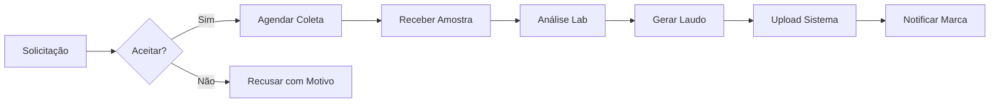

# 🗺️ True Label - Mapas de Jornada do Usuário

## 📋 Índice
1. [Jornada do Consumidor](#jornada-do-consumidor)
2. [Jornada da Marca](#jornada-da-marca)
3. [Jornada do Laboratório](#jornada-do-laboratório)
4. [Pontos de Dor e Oportunidades](#pontos-de-dor-e-oportunidades)
5. [Touchpoints Críticos](#touchpoints-críticos)

## 🛒 Jornada do Consumidor

### Persona: Maria, 35 anos
- Mãe de 2 filhos
- Preocupada com alimentação saudável
- Usuária de smartphone
- Compra no supermercado 2x/semana

### 📍 Mapa da Jornada

```
DESCOBERTA → INTERESSE → VALIDAÇÃO → CONFIANÇA → ADVOCACIA

┌─────────────┬──────────────┬──────────────┬──────────────┬──────────────┐
│ DESCOBERTA  │  INTERESSE   │  VALIDAÇÃO   │  CONFIANÇA   │  ADVOCACIA   │
├─────────────┼──────────────┼──────────────┼──────────────┼──────────────┤
│ • Vê QR no  │ • Escaneia   │ • Lê infos   │ • Compra     │ • Recomenda  │
│   produto   │   código     │   validadas  │   produto    │   para       │
│ • Curiosa   │ • Surpresa   │ • Compara    │ • Satisfeita │   amigas     │
│   sobre o   │   com site   │   com rótulo │ • Volta a    │ • Compartilha│
│   selo      │   bonito     │ • Vê laudos  │   escanear   │   no WhatsApp│
└─────────────┴──────────────┴──────────────┴──────────────┴──────────────┘

EMOÇÕES:
😐 Neutra    😊 Interessada  🤔 Analítica   😄 Confiante   🤩 Defensora

AÇÕES:
📱 Vê QR     📸 Escaneia     📖 Lê dados    🛒 Compra      📢 Compartilha

CANAIS:
🏪 Loja      📱 Mobile Web   📱 PWA         🏪 Loja        💬 Social
```

### 🎭 Momentos da Verdade

#### 1. Primeiro Scan (Make or Break)
**Contexto**: Maria está no corredor do supermercado, crianças com pressa

**Expectativa**: 
- ⏱️ Informação rápida (< 3 segundos)
- 📱 Funcionar no 3G/4G
- 🎯 Resposta clara: "É seguro ou não?"

**Solução True Label**:
```
┌─────────────────────────┐
│    ✅ PRODUTO SEGURO    │ ← Status grande e claro
│    Escaneado agora      │
│    ────────────────     │
│    [Ver Detalhes]       │ ← Opcional para depois
└─────────────────────────┘
```

#### 2. Comparação (Decision Point)
**Contexto**: Comparando 2 produtos similares

**Interface de Comparação**:
```
┌─────────────┬─────────────┐
│  Produto A  │  Produto B  │
├─────────────┼─────────────┤
│ ✅ Validado │ ⚠️ Pendente │
│ Açúcar: 5g  │ Açúcar: 12g │
│ Sódio: 100mg│ Sódio: 450mg│
│ ⭐⭐⭐⭐⭐  │ ⭐⭐⭐      │
└─────────────┴─────────────┘
```

### 📊 Métricas de Sucesso
- **Time to Value**: < 5 segundos
- **Bounce Rate**: < 20%
- **Return Rate**: > 40% (re-scans)
- **Sharing Rate**: > 15%

## 🏢 Jornada da Marca

### Persona: João, 42 anos
- Gerente de Marketing
- Marca média de alimentos
- 50+ SKUs
- Busca diferenciação

### 📍 Mapa da Jornada

```
PESQUISA → TESTE → IMPLEMENTAÇÃO → CRESCIMENTO → EXPANSÃO

┌─────────────┬──────────────┬──────────────┬──────────────┬──────────────┐
│  PESQUISA   │    TESTE     │ IMPLEMENTAÇÃO│ CRESCIMENTO  │  EXPANSÃO    │
├─────────────┼──────────────┼──────────────┼──────────────┼──────────────┤
│ • Descobre  │ • Cria conta │ • Cadastra   │ • Monitora   │ • Adiciona   │
│   TrueLabel │   trial      │   10 produtos│   métricas   │   toda linha │
│ • Compara   │ • Testa com  │ • Treina     │ • Vê ROI     │ • Vira case  │
│   opções    │   1 produto  │   equipe     │   positivo   │   de sucesso │
└─────────────┴──────────────┴──────────────┴──────────────┴──────────────┘

PREOCUPAÇÕES:
💰 Custo     🤔 Facilidade  ⏰ Tempo      📈 Resultados  🏆 Liderança

NECESSIDADES:
📊 ROI       🎯 Simples     🚀 Rápido     📱 Métricas    🌟 Destaque
```

### 🎯 Jobs to be Done

#### Job 1: "Preciso diferenciar meu produto na gôndola"
**Solução**:
- QR Code com design personalizado
- Selo de validação prominente
- Destaque vs concorrência

#### Job 2: "Preciso provar que minhas claims são verdadeiras"
**Solução**:
- Laudos laboratoriais públicos
- Histórico de validações
- Certificações verificáveis

#### Job 3: "Preciso entender meu consumidor melhor"
**Solução**:
```javascript
// Analytics Dashboard
{
  "demographics": {
    "age_groups": {
      "25-34": 35%,
      "35-44": 28%,
      "45-54": 22%
    },
    "locations": {
      "São Paulo": 45%,
      "Rio de Janeiro": 23%
    }
  },
  "behavior": {
    "scan_time": "Sábado 10-12h",
    "rescan_rate": 34%,
    "share_rate": 18%
  }
}
```

### 🚀 Onboarding Otimizado

```
DIA 1: Setup Básico (30 min)
├─ Conta criada ✓
├─ Primeiro produto ✓
└─ QR Code gerado ✓

DIA 7: Primeira Validação
├─ Lab selecionado ✓
├─ Amostra enviada ✓
└─ Status tracking ✓

DIA 30: Primeiros Resultados
├─ 100+ scans ✓
├─ Feedback positivo ✓
└─ Decisão de expansão ✓
```

## 🧪 Jornada do Laboratório

### Persona: Dra. Ana, 38 anos
- Diretora técnica
- Laboratório médio porte
- 15 analistas
- Busca eficiência

### 📍 Mapa da Jornada

```
PARCERIA → INTEGRAÇÃO → OPERAÇÃO → OTIMIZAÇÃO → CRESCIMENTO

┌─────────────┬──────────────┬──────────────┬──────────────┬──────────────┐
│  PARCERIA   │ INTEGRAÇÃO   │  OPERAÇÃO    │ OTIMIZAÇÃO   │ CRESCIMENTO  │
├─────────────┼──────────────┼──────────────┼──────────────┼──────────────┤
│ • Contato   │ • Setup      │ • Primeiras  │ • Automatiza │ • Vira       │
│   comercial │   técnico    │   análises   │   processos  │   referência │
│ • Negocia   │ • Treina     │ • Ajusta     │ • Melhora    │ • Recebe     │
│   termos    │   equipe     │   fluxos     │   margem     │   mais pedidos│
└─────────────┴──────────────┴──────────────┴──────────────┴──────────────┘
```

### 🔧 Ferramentas Específicas

#### Portal do Laboratório
```
┌──────────────────────────────────────┐
│      DASHBOARD LABORATÓRIO           │
├──────────────────────────────────────┤
│ Solicitações Pendentes: 12          │
│ Em Análise: 8                       │
│ Prazo Médio: 4.2 dias               │
│ Taxa de Aprovação: 92%              │
├──────────────────────────────────────┤
│ [Nova Análise] [Relatórios] [Config]│
└──────────────────────────────────────┘
```

#### Workflow de Análise


## 😰 Pontos de Dor e Oportunidades

### 🔴 Pontos de Dor Identificados

#### Consumidor
1. **"Não tenho tempo no supermercado"**
   - Solução: Loading optimizado, cache agressivo
   - Meta: < 2s para informação crítica

2. **"Não entendo termos técnicos"**
   - Solução: Linguagem simples, visual
   - Exemplo: 🟢 Baixo açúcar vs "5g/100g"

3. **"E se não tiver internet?"**
   - Solução: PWA com modo offline
   - Cache últimos 10 produtos scaneados

#### Marca
1. **"Processo muito burocrático"**
   - Solução: Wizard simplificado
   - Upload em lote via CSV
   - Templates prontos

2. **"Custo vs benefício incerto"**
   - Solução: Trial 30 dias
   - Calculadora de ROI
   - Cases de sucesso

3. **"Demora para ver resultados"**
   - Solução: Quick wins
   - Métricas em tempo real
   - Alerts de milestones

#### Laboratório
1. **"Sistema adicional para gerenciar"**
   - Solução: API para integração
   - Export para sistemas existentes
   - Workflow customizável

2. **"Margem baixa por análise"**
   - Solução: Volume garantido
   - Pagamento antecipado
   - Upsell de serviços

## 🎯 Touchpoints Críticos

### 1. Primeiro Contato (Awareness)
```
CANAL          MENSAGEM                    AÇÃO
─────          ────────                    ────
QR Code   →   "Descubra a verdade"    →   Scan
Google    →   "Validação produtos"    →   Landing
Instagram →   "Produtos confiáveis"   →   Link bio
B2B       →   "Diferencie sua marca"  →   Demo
```

### 2. Conversão (Decision)

#### Gatilhos de Conversão:
- **Consumidor**: Informação clara salvou decisão
- **Marca**: Concorrente começou a usar
- **Lab**: Pipeline previsível de receita

### 3. Retenção (Loyalty)

#### Estratégias por Perfil:
```javascript
// Consumidor
const retentionConsumer = {
  tactics: [
    'Notificações de produtos favoritos',
    'Comparador de produtos',
    'Histórico de scans',
    'Programa de pontos'
  ],
  kpi: 'Monthly Active Users'
};

// Marca
const retentionBrand = {
  tactics: [
    'Success manager dedicado',
    'Relatórios customizados',
    'Treinamentos periódicos',
    'Early access features'
  ],
  kpi: 'Net Revenue Retention'
};

// Laboratório
const retentionLab = {
  tactics: [
    'Volume garantido',
    'Pagamento pontual',
    'Sistema integrado',
    'Co-marketing'
  ],
  kpi: 'Análises por mês'
};
```

## 📈 Métricas de UX

### Framework HEART (Google)

#### Happiness (Satisfação)
- NPS > 50
- App Store Rating > 4.5
- CSAT > 85%

#### Engagement (Engajamento)
- DAU/MAU > 40%
- Session Duration > 2min
- Screens per Session > 3

#### Adoption (Adoção)
- New User Activation > 60%
- Feature Adoption > 40%
- Viral Coefficient > 1.2

#### Retention (Retenção)
- 1-day Retention > 50%
- 7-day Retention > 30%
- 30-day Retention > 20%

#### Task Success (Sucesso na Tarefa)
- Scan Success Rate > 95%
- Time to Scan < 5s
- Error Rate < 2%

## 🎨 Design Principles

### 1. Clareza Acima de Tudo
```
❌ "Produto em conformidade com RDC 259/2002"
✅ "Produto Aprovado ✓"
```

### 2. Mobile-First Sempre
- Touch targets mínimo 44x44px
- Texto mínimo 16px
- Contraste WCAG AAA

### 3. Feedback Imediato
- Loading states claros
- Micro-animations
- Haptic feedback

### 4. Personalização Inteligente
```javascript
// Adaptar interface por contexto
if (user.scanHistory.length > 10) {
  showAdvancedFeatures();
}

if (user.lastScan < 24hrs) {
  showQuickActions();
}

if (user.location === 'store') {
  prioritizeSpeed();
}
```

## 🚀 Roadmap de UX

### Q1 2024 ✅
- [x] MVP funcional
- [x] Testes de usabilidade
- [x] Design system básico

### Q2 2024
- [ ] App nativo iOS/Android
- [ ] Voice UI ("Alexa, esse produto é validado?")
- [ ] AR features (realidade aumentada)

### Q3 2024
- [ ] AI Assistant ("Me ajude a escolher")
- [ ] Gamification completa
- [ ] Social features

### Q4 2024
- [ ] Predictive UX
- [ ] Hyper-personalização
- [ ] Omnichannel experience

---

*"O sucesso do True Label não está na tecnologia, mas em como simplificamos a vida das pessoas"* - UX Team