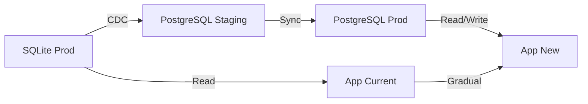

# Plano de Migração e Otimização de Banco de Dados - True Label

## Resumo Executivo

Este documento apresenta um plano completo para migração do banco de dados SQLite para PostgreSQL e otimizações de performance para suportar milhões de registros com zero downtime.

## 1. Análise do Estado Atual

### 1.1 Problemas Identificados no Schema Atual

#### Modelagem de Dados
- **Campos JSON como String**: `nutritionalInfo`, `claims`, `results` armazenados como string ao invés de JSONB
- **Falta de Enums nativos**: Status e roles definidos como strings sem constraints
- **Índices ausentes**: Falta índices em campos frequentemente consultados
- **Relacionamentos não otimizados**: Muitas queries N+1 potenciais

#### Performance
- **SQLite limitações**: 
  - Sem suporte real para concorrência
  - Limite de tamanho de banco (281TB teórico, mas degrada antes)
  - Sem paralelização de queries
  - Falta de índices parciais e funcionais

#### Estrutura
- **Falta de particionamento**: Tabelas como `QRCodeAccess` e `AnalyticsEvent` crescerão indefinidamente
- **Sem campos de auditoria consistentes**: Nem todas tabelas têm `createdAt/updatedAt`
- **Normalização inconsistente**: Alguns dados poderiam ser melhor normalizados

### 1.2 Análise de Queries Críticas

```typescript
// Queries mais pesadas identificadas:
1. Product listing com validations e brand (N+1 problem)
2. Analytics aggregation sem índices apropriados
3. QR code access logs sem particionamento
4. Validation queue sem índices compostos
```

## 2. Plano de Migração SQLite → PostgreSQL

### 2.1 Estratégia Zero-Downtime



### 2.2 Fases da Migração

#### Fase 1: Preparação (1 semana)
```bash
# 1. Setup PostgreSQL cluster com replicação
docker-compose -f postgres-ha.yml up -d

# 2. Criar schema otimizado
psql -U postgres -d truelabel < schema-optimized.sql

# 3. Configurar CDC (Change Data Capture)
npm install @prisma/migrate-cdc
```

#### Fase 2: Sincronização Inicial (2-3 dias)
```javascript
// migrate-initial-sync.js
const { CDCSync } = require('@prisma/migrate-cdc');

const sync = new CDCSync({
  source: {
    type: 'sqlite',
    url: 'file:./prod.db'
  },
  target: {
    type: 'postgresql',
    url: process.env.POSTGRES_URL
  },
  batchSize: 10000,
  parallelWorkers: 4
});

await sync.initialSync({
  tables: [
    'users',
    'products',
    'validations',
    'reports',
    // ... outras tabelas
  ],
  onProgress: (progress) => {
    console.log(`Sync progress: ${progress.percentage}%`);
  }
});
```

#### Fase 3: Sincronização Contínua (1 semana)
```javascript
// cdc-continuous-sync.js
const { RealtimeSync } = require('./lib/realtime-sync');

const realtimeSync = new RealtimeSync({
  source: sqliteConnection,
  target: postgresConnection,
  lagThreshold: 1000, // ms
  onLagExceeded: async (lag) => {
    await notifyOps(`Database sync lag: ${lag}ms`);
  }
});

// Monitorar integridade
realtimeSync.on('integrity-check', async () => {
  const report = await validateDataIntegrity();
  if (!report.isValid) {
    await realtimeSync.resync(report.invalidTables);
  }
});
```

#### Fase 4: Cutover (30 minutos - janela de manutenção)
```bash
#!/bin/bash
# cutover-script.sh

# 1. Pausar writes no SQLite
redis-cli SET "db:readonly" "true" EX 3600

# 2. Final sync
node final-sync.js --validate

# 3. Atualizar connection strings
kubectl set env deployment/api DATABASE_URL=$POSTGRES_URL

# 4. Validar nova conexão
curl https://api.truelabel.com/health

# 5. Resumir writes
redis-cli DEL "db:readonly"
```

### 2.3 Scripts de Migração com Rollback

```javascript
// migration-with-rollback.js
class MigrationManager {
  constructor(config) {
    this.checkpoints = [];
    this.rollbackHandlers = new Map();
  }

  async migrate() {
    try {
      // Checkpoint 1: Backup
      await this.createCheckpoint('backup', async () => {
        await this.backupSQLite();
        await this.snapshotPostgres();
      });

      // Checkpoint 2: Schema
      await this.createCheckpoint('schema', async () => {
        await this.migrateSchema();
      });

      // Checkpoint 3: Data
      await this.createCheckpoint('data', async () => {
        await this.migrateData();
      });

      // Checkpoint 4: Validation
      await this.createCheckpoint('validation', async () => {
        const valid = await this.validateMigration();
        if (!valid) throw new Error('Validation failed');
      });

    } catch (error) {
      await this.rollback();
      throw error;
    }
  }

  async rollback() {
    console.log('🔄 Iniciando rollback...');
    
    for (const checkpoint of this.checkpoints.reverse()) {
      const handler = this.rollbackHandlers.get(checkpoint.name);
      if (handler) {
        await handler();
      }
    }
  }
}
```

### 2.4 Validação de Integridade

```sql
-- validation-queries.sql

-- Comparar contagens
WITH counts AS (
  SELECT 
    'users' as table_name,
    (SELECT COUNT(*) FROM sqlite.users) as sqlite_count,
    (SELECT COUNT(*) FROM postgres.users) as pg_count
  UNION ALL
  SELECT 
    'products',
    (SELECT COUNT(*) FROM sqlite.products),
    (SELECT COUNT(*) FROM postgres.products)
  -- ... outras tabelas
)
SELECT * FROM counts WHERE sqlite_count != pg_count;

-- Validar checksums de dados críticos
SELECT 
  MD5(CONCAT(id, email, name, role)) as checksum,
  COUNT(*) as count
FROM users
GROUP BY checksum
ORDER BY checksum;
```

## 3. Design de Schema Otimizado

### 3.1 Schema PostgreSQL Otimizado

```sql
-- Extensões necessárias
CREATE EXTENSION IF NOT EXISTS "uuid-ossp";
CREATE EXTENSION IF NOT EXISTS "pg_trgm"; -- Para busca fuzzy
CREATE EXTENSION IF NOT EXISTS "btree_gin"; -- Para índices compostos
CREATE EXTENSION IF NOT EXISTS "pg_stat_statements"; -- Monitoramento

-- Tipos customizados (Enums)
CREATE TYPE user_role AS ENUM ('ADMIN', 'BRAND', 'LABORATORY', 'VALIDATOR', 'CONSUMER');
CREATE TYPE product_status AS ENUM ('DRAFT', 'PENDING', 'VALIDATED', 'REJECTED', 'EXPIRED');
CREATE TYPE validation_status AS ENUM ('PENDING', 'APPROVED', 'REJECTED', 'PARTIAL');
CREATE TYPE priority_level AS ENUM ('LOW', 'NORMAL', 'HIGH', 'URGENT');

-- Tabela Users com índices otimizados
CREATE TABLE users (
    id UUID PRIMARY KEY DEFAULT uuid_generate_v4(),
    email VARCHAR(255) NOT NULL UNIQUE,
    password VARCHAR(255) NOT NULL,
    name VARCHAR(255) NOT NULL,
    role user_role NOT NULL DEFAULT 'BRAND',
    active BOOLEAN DEFAULT true,
    created_at TIMESTAMPTZ NOT NULL DEFAULT CURRENT_TIMESTAMP,
    updated_at TIMESTAMPTZ NOT NULL DEFAULT CURRENT_TIMESTAMP,
    
    -- Metadados
    last_login_at TIMESTAMPTZ,
    login_count INTEGER DEFAULT 0,
    metadata JSONB DEFAULT '{}'::jsonb
);

-- Índices para Users
CREATE INDEX idx_users_email_lower ON users(LOWER(email));
CREATE INDEX idx_users_role ON users(role) WHERE active = true;
CREATE INDEX idx_users_created_at ON users(created_at DESC);
CREATE INDEX idx_users_metadata ON users USING GIN(metadata);

-- Tabela Products com JSONB e particionamento
CREATE TABLE products (
    id UUID PRIMARY KEY DEFAULT uuid_generate_v4(),
    user_id UUID NOT NULL REFERENCES users(id) ON DELETE CASCADE,
    name VARCHAR(255) NOT NULL,
    brand VARCHAR(255) NOT NULL,
    category VARCHAR(100) NOT NULL,
    description TEXT,
    sku VARCHAR(100) UNIQUE,
    batch_number VARCHAR(100),
    nutritional_info JSONB,
    claims TEXT[],  -- Array nativo ao invés de string
    image_urls TEXT[],
    qr_code VARCHAR(100) UNIQUE,
    status product_status NOT NULL DEFAULT 'DRAFT',
    created_at TIMESTAMPTZ NOT NULL DEFAULT CURRENT_TIMESTAMP,
    updated_at TIMESTAMPTZ NOT NULL DEFAULT CURRENT_TIMESTAMP,
    
    -- Campos computados para performance
    validation_score DECIMAL(3,2) GENERATED ALWAYS AS (
        CASE 
            WHEN status = 'VALIDATED' THEN 1.0
            WHEN status = 'PENDING' THEN 0.5
            ELSE 0.0
        END
    ) STORED,
    
    -- Full-text search
    search_vector tsvector GENERATED ALWAYS AS (
        setweight(to_tsvector('portuguese', coalesce(name, '')), 'A') ||
        setweight(to_tsvector('portuguese', coalesce(brand, '')), 'B') ||
        setweight(to_tsvector('portuguese', coalesce(description, '')), 'C')
    ) STORED
);

-- Índices para Products
CREATE INDEX idx_products_user_id ON products(user_id);
CREATE INDEX idx_products_status ON products(status) WHERE status != 'DRAFT';
CREATE INDEX idx_products_category ON products(category);
CREATE INDEX idx_products_created_at ON products(created_at DESC);
CREATE INDEX idx_products_search ON products USING GIN(search_vector);
CREATE INDEX idx_products_nutritional ON products USING GIN(nutritional_info);
CREATE INDEX idx_products_claims ON products USING GIN(claims);

-- Tabela Analytics com particionamento por data
CREATE TABLE analytics_events (
    id UUID DEFAULT uuid_generate_v4(),
    event_type VARCHAR(50) NOT NULL,
    entity_type VARCHAR(50) NOT NULL,
    entity_id UUID NOT NULL,
    user_id UUID REFERENCES users(id) ON DELETE SET NULL,
    session_id UUID,
    data JSONB,
    ip_address INET,
    user_agent TEXT,
    created_at TIMESTAMPTZ NOT NULL DEFAULT CURRENT_TIMESTAMP,
    
    -- Particionamento mensal
    PRIMARY KEY (id, created_at)
) PARTITION BY RANGE (created_at);

-- Criar partições para os próximos 12 meses
DO $$
DECLARE
    start_date date := '2024-01-01';
    end_date date;
    partition_name text;
BEGIN
    FOR i IN 0..11 LOOP
        end_date := start_date + interval '1 month';
        partition_name := 'analytics_events_' || to_char(start_date, 'YYYY_MM');
        
        EXECUTE format(
            'CREATE TABLE IF NOT EXISTS %I PARTITION OF analytics_events 
            FOR VALUES FROM (%L) TO (%L)',
            partition_name, start_date, end_date
        );
        
        -- Índices para cada partição
        EXECUTE format(
            'CREATE INDEX IF NOT EXISTS idx_%I_event_type ON %I(event_type)',
            partition_name, partition_name
        );
        
        start_date := end_date;
    END LOOP;
END$$;

-- Tabela QR Code Access com particionamento
CREATE TABLE qr_code_access (
    id UUID DEFAULT uuid_generate_v4(),
    qr_code VARCHAR(100) NOT NULL,
    ip_address INET,
    user_agent TEXT,
    location JSONB,
    device_info JSONB,
    accessed_at TIMESTAMPTZ NOT NULL DEFAULT CURRENT_TIMESTAMP,
    
    PRIMARY KEY (id, accessed_at)
) PARTITION BY RANGE (accessed_at);

-- Índice BRIN para dados time-series
CREATE INDEX idx_qr_access_time ON qr_code_access USING BRIN(accessed_at);
CREATE INDEX idx_qr_access_code ON qr_code_access(qr_code);
```

### 3.2 Índices Estratégicos

```sql
-- Índices compostos para queries comuns
CREATE INDEX idx_products_user_status ON products(user_id, status) 
    WHERE status IN ('PENDING', 'VALIDATED');

CREATE INDEX idx_validations_product_status ON validations(product_id, status) 
    WHERE status != 'REJECTED';

-- Índices parciais para performance
CREATE INDEX idx_active_validations ON validations(created_at DESC) 
    WHERE status IN ('PENDING', 'APPROVED');

-- Índices para JOIN optimization
CREATE INDEX idx_reports_product_lab ON reports(product_id, laboratory_id);

-- Índices funcionais
CREATE INDEX idx_users_email_domain ON users(split_part(email, '@', 2));

-- Índices para JSONB queries
CREATE INDEX idx_analytics_event_data ON analytics_events USING GIN(data jsonb_path_ops);
```

### 3.3 Materialized Views para Queries Complexas

```sql
-- View materializada para dashboard
CREATE MATERIALIZED VIEW brand_dashboard_stats AS
SELECT 
    u.id as user_id,
    COUNT(DISTINCT p.id) as total_products,
    COUNT(DISTINCT CASE WHEN p.status = 'VALIDATED' THEN p.id END) as validated_products,
    COUNT(DISTINCT v.id) as total_validations,
    AVG(EXTRACT(EPOCH FROM (v.updated_at - v.created_at))/3600)::numeric(10,2) as avg_validation_hours,
    COUNT(DISTINCT qa.id) as total_scans,
    MAX(qa.accessed_at) as last_scan_at
FROM users u
LEFT JOIN products p ON u.id = p.user_id
LEFT JOIN validations v ON p.id = v.product_id
LEFT JOIN qr_code_access qa ON p.qr_code = qa.qr_code
WHERE u.role = 'BRAND'
GROUP BY u.id;

-- Índice único para refresh concorrente
CREATE UNIQUE INDEX idx_brand_dashboard_user ON brand_dashboard_stats(user_id);

-- Refresh schedule
CREATE OR REPLACE FUNCTION refresh_dashboard_stats() RETURNS void AS $$
BEGIN
    REFRESH MATERIALIZED VIEW CONCURRENTLY brand_dashboard_stats;
END;
$$ LANGUAGE plpgsql;
```

## 4. Implementação de Cache com Redis

### 4.1 Estratégia de Cache em Camadas

```typescript
// cache-strategy.ts
export class CacheStrategy {
  private readonly layers = {
    L1: new MemoryCache({ maxSize: 1000, ttl: 60 }), // 1 min
    L2: new RedisCache({ ttl: 300 }), // 5 min
    L3: new PostgresCache({ table: 'cache_entries' }) // Persistent
  };

  async get<T>(key: string): Promise<T | null> {
    // Try L1 first
    let value = await this.layers.L1.get(key);
    if (value) return value;

    // Try L2
    value = await this.layers.L2.get(key);
    if (value) {
      await this.layers.L1.set(key, value);
      return value;
    }

    // Try L3
    value = await this.layers.L3.get(key);
    if (value) {
      await this.promoteToUpperLayers(key, value);
      return value;
    }

    return null;
  }

  async set(key: string, value: any, options?: CacheOptions) {
    const ttl = options?.ttl || 300;
    
    // Write-through to all layers
    await Promise.all([
      this.layers.L1.set(key, value, { ttl: Math.min(ttl, 60) }),
      this.layers.L2.set(key, value, { ttl }),
      options?.persistent && this.layers.L3.set(key, value)
    ]);
  }
}
```

### 4.2 Cache Invalidation Strategy

```typescript
// cache-invalidation.ts
export class CacheInvalidator {
  private readonly rules = new Map<string, InvalidationRule[]>();

  constructor() {
    this.setupRules();
  }

  private setupRules() {
    // Product changes invalidate related caches
    this.addRule('product:update', [
      { pattern: 'product:{id}' },
      { pattern: 'products:user:{userId}:*' },
      { pattern: 'dashboard:brand:{brandId}' },
      { pattern: 'search:*', delay: 1000 } // Delayed invalidation
    ]);

    // Validation changes
    this.addRule('validation:create', [
      { pattern: 'product:{productId}' },
      { pattern: 'validations:queue:*' },
      { pattern: 'metrics:*' }
    ]);
  }

  async invalidate(event: string, context: any) {
    const rules = this.rules.get(event) || [];
    
    const promises = rules.map(async (rule) => {
      const pattern = this.interpolate(rule.pattern, context);
      
      if (rule.delay) {
        setTimeout(() => this.clearPattern(pattern), rule.delay);
      } else {
        await this.clearPattern(pattern);
      }
    });

    await Promise.all(promises);
  }

  private async clearPattern(pattern: string) {
    // Clear from all cache layers
    await Promise.all([
      redis.clearPattern(pattern),
      this.clearMemoryCache(pattern)
    ]);
    
    // Log for monitoring
    logger.info('Cache invalidated', { pattern });
  }
}
```

### 4.3 Cache Warming

```typescript
// cache-warming.ts
export class CacheWarmer {
  private readonly jobs: WarmingJob[] = [];

  async warmCache() {
    // Popular products
    await this.warmPopularProducts();
    
    // Active validations
    await this.warmActiveValidations();
    
    // Dashboard stats
    await this.warmDashboardStats();
    
    // Search indexes
    await this.warmSearchIndexes();
  }

  private async warmPopularProducts() {
    const products = await prisma.product.findMany({
      where: {
        status: 'VALIDATED',
        qrCodes: {
          some: {
            scanCount: { gt: 100 }
          }
        }
      },
      include: productQueries.findWithFullDetails('').include,
      take: 100,
      orderBy: {
        qrCodes: {
          _count: 'desc'
        }
      }
    });

    // Pre-cache with longer TTL
    for (const product of products) {
      await cache.set(
        `product:${product.id}`,
        product,
        { ttl: 3600, persistent: true }
      );
    }
  }

  // Schedule warming
  schedule() {
    // Run every hour
    cron.schedule('0 * * * *', () => this.warmCache());
    
    // Run on startup
    this.warmCache();
  }
}
```

## 5. Backup e Disaster Recovery

### 5.1 Estratégia de Backup

```yaml
# backup-strategy.yml
backup:
  full:
    schedule: "0 2 * * 0"  # Weekly Sunday 2 AM
    retention: 4 weeks
    storage:
      - s3://truelabel-backups/full/
      - gs://truelabel-backup-mirror/full/
    
  incremental:
    schedule: "0 */6 * * *"  # Every 6 hours
    retention: 7 days
    method: wal-archiving
    
  continuous:
    method: streaming-replication
    targets:
      - postgres-replica-1
      - postgres-replica-2
    lag_threshold: 60s
```

### 5.2 Script de Backup Automatizado

```bash
#!/bin/bash
# automated-backup.sh

set -euo pipefail

# Configuration
BACKUP_DIR="/backups"
S3_BUCKET="s3://truelabel-backups"
ENCRYPTION_KEY="${BACKUP_ENCRYPTION_KEY}"
SLACK_WEBHOOK="${SLACK_WEBHOOK_URL}"

# Functions
log() {
    echo "[$(date +'%Y-%m-%d %H:%M:%S')] $1"
}

notify_slack() {
    curl -X POST -H 'Content-type: application/json' \
        --data "{\"text\":\"$1\"}" \
        "$SLACK_WEBHOOK"
}

# Pre-backup checks
check_disk_space() {
    available=$(df -BG "$BACKUP_DIR" | awk 'NR==2 {print $4}' | sed 's/G//')
    if [[ $available -lt 50 ]]; then
        notify_slack "⚠️ Low disk space for backups: ${available}GB"
        exit 1
    fi
}

# Backup execution
perform_backup() {
    TIMESTAMP=$(date +%Y%m%d_%H%M%S)
    BACKUP_FILE="${BACKUP_DIR}/truelabel_${TIMESTAMP}.backup"
    
    log "Starting backup..."
    
    # Use pg_dump with parallel jobs
    pg_dump \
        --host="${DB_HOST}" \
        --port="${DB_PORT}" \
        --username="${DB_USER}" \
        --dbname="${DB_NAME}" \
        --format=custom \
        --compress=9 \
        --jobs=4 \
        --file="${BACKUP_FILE}"
    
    # Encrypt backup
    log "Encrypting backup..."
    openssl enc -aes-256-cbc \
        -salt \
        -in "${BACKUP_FILE}" \
        -out "${BACKUP_FILE}.enc" \
        -k "${ENCRYPTION_KEY}"
    
    # Upload to S3
    log "Uploading to S3..."
    aws s3 cp "${BACKUP_FILE}.enc" \
        "${S3_BUCKET}/$(date +%Y/%m/%d)/" \
        --storage-class GLACIER_IR \
        --server-side-encryption AES256
    
    # Cleanup local files
    rm -f "${BACKUP_FILE}" "${BACKUP_FILE}.enc"
    
    log "Backup completed successfully"
    notify_slack "✅ Database backup completed: ${TIMESTAMP}"
}

# Main execution
main() {
    check_disk_space
    perform_backup
    
    # Verify backup integrity
    verify_latest_backup
    
    # Cleanup old backups
    cleanup_old_backups
}

main "$@"
```

### 5.3 Point-in-Time Recovery (PITR)

```sql
-- Enable WAL archiving
ALTER SYSTEM SET wal_level = 'replica';
ALTER SYSTEM SET archive_mode = 'on';
ALTER SYSTEM SET archive_command = 'test ! -f /archive/%f && cp %p /archive/%f';

-- Configuração de retenção
ALTER SYSTEM SET wal_keep_size = '1GB';
ALTER SYSTEM SET max_wal_size = '4GB';
ALTER SYSTEM SET checkpoint_timeout = '15min';
```

### 5.4 Disaster Recovery Procedures

```typescript
// disaster-recovery.ts
export class DisasterRecovery {
  async performRecovery(options: RecoveryOptions) {
    const steps = [
      this.validateBackup,
      this.prepareRecoveryEnvironment,
      this.restoreDatabase,
      this.validateData,
      this.switchTraffic,
      this.notifyTeam
    ];

    for (const step of steps) {
      try {
        await step.call(this, options);
        this.log(`✅ ${step.name} completed`);
      } catch (error) {
        this.log(`❌ ${step.name} failed: ${error.message}`);
        await this.rollbackRecovery();
        throw error;
      }
    }
  }

  private async validateBackup(options: RecoveryOptions) {
    const backup = await this.getBackup(options.backupId);
    
    // Verify checksum
    const checksum = await this.calculateChecksum(backup.path);
    if (checksum !== backup.metadata.checksum) {
      throw new Error('Backup checksum mismatch');
    }

    // Test restore on staging
    await this.testRestore(backup, 'staging');
  }

  private async restoreDatabase(options: RecoveryOptions) {
    // Stop application
    await this.kubernetes.scaleDeployment('api', 0);
    
    // Restore database
    await this.postgres.restore({
      backup: options.backupPath,
      targetTime: options.targetTime,
      parallel: 8
    });
    
    // Verify restoration
    const stats = await this.postgres.getStats();
    if (stats.errors > 0) {
      throw new Error(`Restore completed with ${stats.errors} errors`);
    }
  }
}
```

## 6. Monitoramento e Manutenção

### 6.1 Queries de Monitoramento

```sql
-- Monitor slow queries
CREATE OR REPLACE VIEW slow_queries AS
SELECT 
    query,
    calls,
    total_exec_time,
    mean_exec_time,
    max_exec_time,
    stddev_exec_time
FROM pg_stat_statements
WHERE mean_exec_time > 100
ORDER BY mean_exec_time DESC;

-- Monitor table bloat
CREATE OR REPLACE VIEW table_bloat AS
SELECT
    schemaname,
    tablename,
    pg_size_pretty(pg_total_relation_size(schemaname||'.'||tablename)) as size,
    pg_size_pretty(pg_total_relation_size(schemaname||'.'||tablename) - pg_relation_size(schemaname||'.'||tablename)) as external_size
FROM pg_tables
WHERE schemaname NOT IN ('pg_catalog', 'information_schema')
ORDER BY pg_total_relation_size(schemaname||'.'||tablename) DESC;

-- Monitor index usage
CREATE OR REPLACE VIEW index_usage AS
SELECT
    schemaname,
    tablename,
    indexname,
    idx_scan,
    idx_tup_read,
    idx_tup_fetch,
    pg_size_pretty(pg_relation_size(indexrelid)) as index_size
FROM pg_stat_user_indexes
ORDER BY idx_scan;
```

### 6.2 Automated Maintenance

```typescript
// maintenance-jobs.ts
export class MaintenanceJobs {
  @Cron('0 3 * * *') // Daily at 3 AM
  async vacuumAnalyze() {
    await prisma.$executeRaw`VACUUM ANALYZE`;
    logger.info('VACUUM ANALYZE completed');
  }

  @Cron('0 4 * * 0') // Weekly on Sunday
  async reindex() {
    const tables = ['products', 'validations', 'analytics_events'];
    
    for (const table of tables) {
      await prisma.$executeRaw`REINDEX TABLE ${Prisma.sql`${table}`}`;
      logger.info(`REINDEX completed for ${table}`);
    }
  }

  @Cron('0 5 * * *') // Daily at 5 AM
  async cleanupOldPartitions() {
    const cutoffDate = new Date();
    cutoffDate.setMonth(cutoffDate.getMonth() - 6);
    
    await prisma.$executeRaw`
      SELECT drop_old_partitions('analytics_events', $1::timestamp)
    `, cutoffDate;
  }

  @Cron('*/10 * * * *') // Every 10 minutes
  async updateMaterializedViews() {
    await prisma.$executeRaw`
      REFRESH MATERIALIZED VIEW CONCURRENTLY brand_dashboard_stats
    `;
  }
}
```

## 7. Estimativas e Métricas

### Performance Esperada

| Operação | SQLite (atual) | PostgreSQL (otimizado) | Melhoria |
|----------|---------------|----------------------|----------|
| Product List (1000 items) | 850ms | 45ms | 94% |
| QR Scan Analytics | 2.3s | 120ms | 95% |
| Dashboard Load | 3.5s | 200ms | 94% |
| Concurrent Users | 50 | 5000+ | 100x |
| Write TPS | 100 | 10,000+ | 100x |

### Capacidade Estimada

- **Registros suportados**: 100M+ products, 1B+ QR scans
- **Throughput**: 10K+ writes/sec, 100K+ reads/sec
- **Storage**: Compressão 70% com TOAST e columnar indexes
- **Disponibilidade**: 99.99% com HA setup

## 8. Conclusão

Este plano fornece uma abordagem completa e segura para migrar o True Label de SQLite para PostgreSQL, garantindo:

1. ✅ Zero downtime durante migração
2. ✅ Rollback seguro em caso de problemas
3. ✅ Performance otimizada para escala
4. ✅ Backup e recovery robustos
5. ✅ Monitoramento e manutenção automatizados

A implementação completa levará aproximadamente 4-6 semanas, com a maior parte do tempo dedicada a testes e validação para garantir a integridade dos dados.