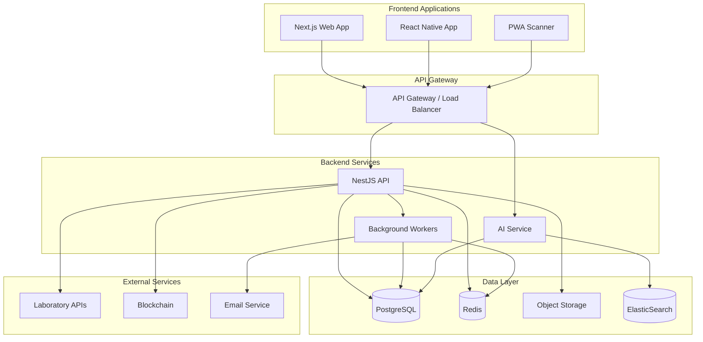
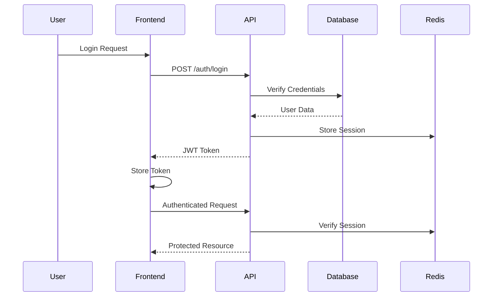
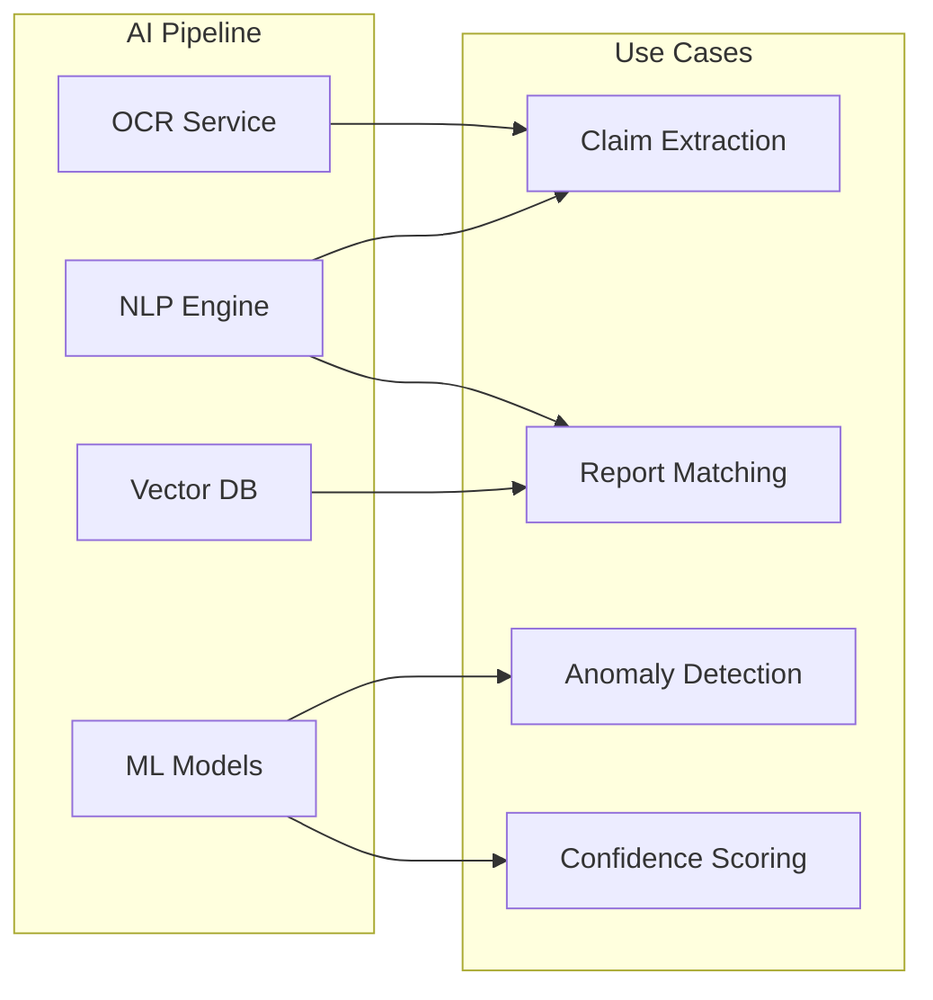
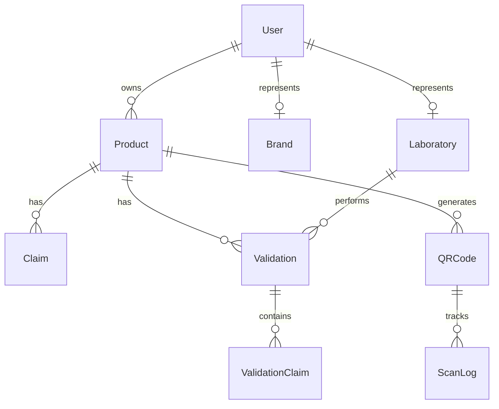
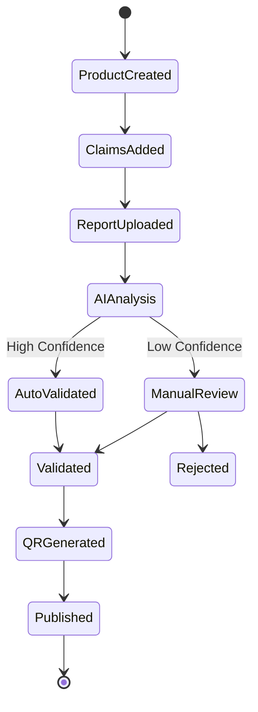
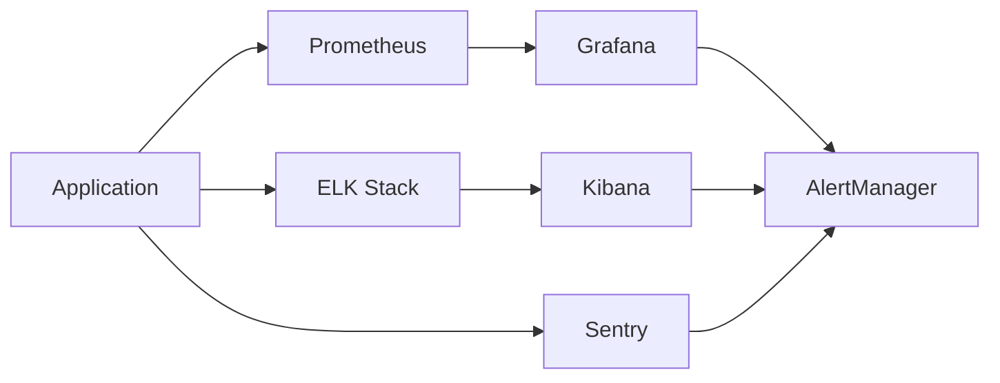

# TRUST LABEL - Architecture Overview

## 🏗️ System Architecture

### High-Level Overview



## 📦 Technology Stack

### Frontend
- **Framework**: Next.js 14 (App Router)
- **UI Library**: React 18
- **Styling**: Tailwind CSS + Radix UI
- **State Management**: TanStack Query + Zustand
- **Authentication**: NextAuth.js
- **Forms**: React Hook Form + Zod
- **Charts**: Recharts
- **QR Code**: react-qr-code

### Backend
- **Framework**: NestJS 10
- **Database**: PostgreSQL 16
- **ORM**: Prisma 5
- **Cache**: Redis 7
- **Queue**: Bull
- **Storage**: MinIO/S3
- **Search**: ElasticSearch 8
- **AI**: OpenAI GPT-4 + LangChain

### Infrastructure
- **Container**: Docker
- **Orchestration**: Kubernetes
- **CI/CD**: GitHub Actions
- **Monitoring**: Prometheus + Grafana
- **Logging**: ELK Stack
- **APM**: Sentry

## 🔐 Security Architecture

### Authentication Flow


### Security Measures
1. **Authentication**: JWT with refresh tokens
2. **Authorization**: Role-based access control (RBAC)
3. **Encryption**: TLS 1.3 for transport, AES-256 for storage
4. **Rate Limiting**: Per-IP and per-user limits
5. **Input Validation**: Zod schemas + class-validator
6. **SQL Injection**: Parameterized queries via Prisma
7. **XSS Protection**: Content Security Policy (CSP)
8. **CORS**: Whitelist allowed origins

## 🧠 AI Architecture

### AI Services


### AI Components
1. **OCR**: Extract text from product labels
2. **NLP**: Process claims and reports
3. **Vector Search**: Semantic matching
4. **ML Models**: Anomaly detection and scoring
5. **LLM Integration**: OpenAI GPT-4 for analysis

## 📊 Data Architecture

### Database Schema Overview


### Data Flow
1. **Write Path**: API → PostgreSQL → Redis Cache
2. **Read Path**: API → Redis Cache → PostgreSQL (fallback)
3. **Search Path**: API → ElasticSearch
4. **Analytics Path**: PostgreSQL → ETL → Data Warehouse

## 🔄 Validation Workflow

### Validation Process


### Validation States
- **PENDING**: Awaiting laboratory report
- **IN_REVIEW**: Under AI/manual review
- **VALIDATED**: Approved
- **VALIDATED_WITH_REMARKS**: Approved with notes
- **REJECTED**: Failed validation
- **EXPIRED**: Past validity period

## 🚀 Deployment Architecture

### Production Environment
```yaml
Cluster Layout:
├── Namespace: trust-label-prod
│   ├── Deployments
│   │   ├── web (3 replicas)
│   │   ├── api (5 replicas)
│   │   ├── ai-service (2 replicas)
│   │   └── workers (3 replicas)
│   ├── Services
│   │   ├── web-service (LoadBalancer)
│   │   ├── api-service (ClusterIP)
│   │   └── ai-service (ClusterIP)
│   └── Ingress
│       └── trust-label-ingress
```

### Scaling Strategy
1. **Horizontal Scaling**: Auto-scaling based on CPU/memory
2. **Database**: Read replicas for queries
3. **Cache**: Redis Cluster for high availability
4. **CDN**: CloudFlare for static assets
5. **Queue**: Multiple workers for job processing

## 📈 Performance Optimization

### Caching Strategy
1. **Browser Cache**: Static assets (1 year)
2. **CDN Cache**: Images and documents (1 month)
3. **Redis Cache**: 
   - Session data (15 minutes)
   - Product data (5 minutes)
   - Validation results (1 hour)
4. **Database Cache**: Query result caching

### Performance Targets
- **API Response Time**: < 100ms (p95)
- **Page Load Time**: < 2s (p95)
- **QR Scan to Result**: < 1s
- **Validation Processing**: < 30s
- **Uptime**: 99.9%

## 🔍 Monitoring & Observability

### Metrics Collection


### Key Metrics
1. **Business Metrics**:
   - Daily active users
   - QR scans per day
   - Validation success rate
   - Revenue per customer

2. **Technical Metrics**:
   - API latency
   - Error rates
   - Database performance
   - Queue length

3. **Infrastructure Metrics**:
   - CPU/Memory usage
   - Disk I/O
   - Network throughput
   - Container health

## 🔄 Disaster Recovery

### Backup Strategy
1. **Database**: Daily automated backups (30-day retention)
2. **Object Storage**: Cross-region replication
3. **Code**: Git with multiple remotes
4. **Configuration**: Encrypted in version control

### Recovery Procedures
- **RTO (Recovery Time Objective)**: 4 hours
- **RPO (Recovery Point Objective)**: 1 hour
- **Failover**: Automated with health checks
- **Data Recovery**: Point-in-time recovery available

---

For detailed implementation guides, see:
- [API Documentation](./API.md)
- [Frontend Guide](./FRONTEND.md)
- [Deployment Guide](./DEPLOYMENT.md)
- [Security Guide](./SECURITY.md)